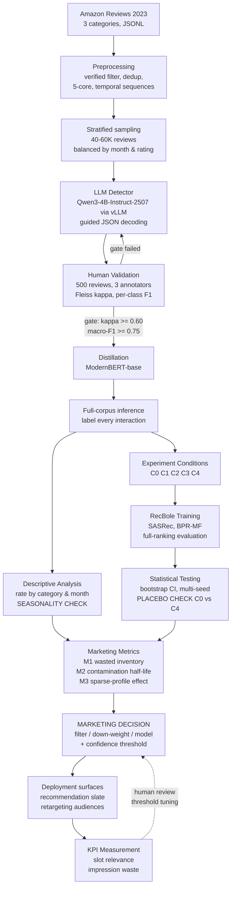

# Concept Note

**AI in Marketing Capstone**

---

## Project Information

**Project Title:** *This Was Not For Me — Detecting Gift Purchases as a Distinct Class of Noise in E-Commerce Recommender Systems*

**Team Members:** [Team Member 1] / [Team Member 2] / [Team Member 3]

**Repository:** [GitHub URL]

**Submission Date:** August 2026

---

## 1. Project Overview

### 1.1 The problem

E-commerce personalisation rests on one inference that is almost never questioned: **a purchase reveals a preference.** Recommender systems trained on implicit feedback treat every completed transaction as positive evidence about the buyer's taste and build the customer profile from the accumulation of those signals.

The inference fails systematically for one class of transaction — purchases made **for someone else**. When a customer buys a toy for a nephew, a perfume for a parent, or a coffee machine for an office gift exchange, the system records a preference the customer does not hold, then propagates that false signal forward for weeks or months.

Two properties make this failure worth measuring rather than tolerating. First, it is **structural, not random**: it concentrates in specific categories and specific calendar windows, so it does not attenuate in aggregate the way random noise does. Second, it is **observable in text** — buyers routinely disclose the recipient in their own reviews ("bought this for my daughter's birthday"), which makes the signal recoverable in a way that mis-clicks and silent dissatisfaction are not.

### 1.2 Marketing context

| Dimension | Specification |
|---|---|
| **Target customer** | Existing e-commerce customers with prior purchase and review history |
| **Product / service** | Multi-category online retail; three categories studied (see §6) |
| **Channel** | Owned recommendation surfaces — homepage, product detail page, lifecycle email — plus paid retargeting audiences |
| **Customer journey stage** | Retention and repeat purchase (not acquisition) |
| **Business process** | Always-on personalisation; specifically the **data preparation layer** upstream of model training |
| **Decision owner** | Personalisation / CRM lead deciding whether to filter, down-weight, or model the gift signal |

### 1.3 Why solving it matters

The commercial magnitude is not speculative. Industry estimates place gift purchases at roughly **70% of total US holiday spending**, amounting to an estimated **$693.7 billion in 2024** and a projected **$715.9 billion in 2025**. The concentration is category-specific: the holiday period accounts for approximately **34.9% of annual hobby, toy and game sales**, **34.7% of jewellery sales**, and **31.1% of electronics sales**, while **61% of holiday gift shoppers purchase toys**. A category where a third of annual volume falls in a gift-dominated window is a category where a substantial share of the training signal may not describe the buyer at all.

The impact of solving it decomposes into three effects:

**Slot displacement.** Recommendation surfaces have fixed capacity — roughly twenty homepage positions, six email slots, one to three retargeting placements. A slot occupied by a contaminated recommendation is denied to a product the customer might actually buy. The cost is an opportunity cost incurred on every impression.

**Retargeting waste.** In paid retargeting the cost is cash rather than opportunity. The advertiser pays, the platform collects, and the impression targets a preference that never existed.

**Disproportionate harm to sparse profiles.** For a customer with five recorded interactions, one gift purchase misdirects 20% of the available signal. Contamination therefore does most damage precisely where personalisation is weakest — the new or low-frequency customer, who is also the most valuable to convert into a repeat buyer.

A final property makes the intervention unusually attractive commercially: because it operates on the training signal rather than the model, **any remedy requires no change to the recommendation architecture, the serving infrastructure, or the customer-facing experience.** It is a filter. For a marketing organisation that is the cheapest class of change available.

---

## 2. Objectives and Marketing KPIs

### 2.1 Objectives

| # | Objective | Research question |
|---|---|---|
| O1 | Quantify the prevalence of gift purchases in a public e-commerce interaction corpus, by category and by month | RQ1 |
| O2 | Measure whether removing or down-weighting gift interactions improves prediction of the customer's **own** next purchase | RQ2 |
| O3 | Determine empirically whether the gift signal should be **removed** or **modelled** | RQ3 |
| O4 | Quantify how long a single gift purchase distorts the recommendation slate | RQ4 |

**A note on framing.** O2 is posed as a question of *sensitivity*, not of *improvement*. A finding that modern sequential architectures are robust to this contamination answers the question as completely as a finding that they are not — and would itself be a useful result, since industry patent filings implicitly assume the distortion is severe. This framing is deliberate and is reflected in the success criteria below.

### 2.2 Marketing KPIs and success criteria

**Primary marketing KPIs**

| KPI | Definition | Baseline | Target / criterion |
|---|---|---|---|
| **Contamination rate** | Share of interactions classified as purchased for another person, by category and month | No semantic estimate exists publicly. A lexical lower bound measured for this project gives 11.07% (Toys), 4.40% (Video Games), 1.85% (Grocery) at 58.3% precision | Produce first public semantic estimate with confidence intervals |
| **Wasted personalisation inventory (M1)** | Share of recommendation slots drawn from categories the customer entered only via a gift purchase | Measured under C0 | Report absolute value and change under intervention |
| **Contamination half-life (M2)** | Weeks until the gift category's share of the slate decays to half its post-purchase peak | Measured under C0 | Report with confidence interval |
| **Recommendation quality on self-purchases** | Recall@10 / NDCG@10, evaluated **only** on held-out items classified as self-purchases | C0 — train on all interactions (current industry practice) | See decision rule below |

**Supporting technical criteria** *(gates, not goals — each must be met for the marketing KPIs to be trustworthy)*

| Criterion | Threshold | Consequence if unmet |
|---|---|---|
| Inter-annotator agreement (Fleiss' κ, 3 annotators, 500 items) | **κ ≥ 0.60** | Merge `household` into `unclear`; revise schema and re-annotate |
| Detector precision on `gift_given` | **≥ 0.80** | Raise confidence threshold; precision prioritised over recall because a false positive suppresses personalisation for a real customer |
| Detector macro-F1 vs. human labels | **≥ 0.75** | Revise prompt (v2) or switch primary model |
| Distillation fidelity (ModernBERT vs. LLM macro-F1) | **within 5 pp** | Increase annotation sample or revisit distillation target |
| Seasonality check | Dec–Jan rate materially above annual mean | **Stop and revise** — detector is not capturing gift intent |
| Category ordering | Toys > Video Games > Grocery | **Stop and revise** — detector is capturing something other than gift intent |
| **Placebo validity** | C0 vs C4 difference **not** significant | Experimental setup is broken; results uninterpretable |

> **Erratum — 2026-09-20 (audit).** Three of the criteria above were not met as written, and
> the project proceeded anyway. Recording that here rather than leaving it to the reader:
> (a) **detector macro-F1 measured 0.5405** [0.4897–0.5869] against the human labels, not
> ≥ 0.75, and **`gift_given` precision measured 0.68** (0.6485 population-weighted), not
> ≥ 0.80 — neither threshold was ever written into `configs/base.yaml`, so neither was
> enforced as a gate; (b) inter-annotator agreement was **never measured** — only one of the
> three annotators delivered, so Week 4 closed as INCOMPLETE and κ was not computed;
> (c) the **placebo criterion was reformulated before the runs** (2026-09-14) to "the placebo
> must not *beat* C0", because random deletion is expected to *hurt* accuracy — under the
> wording above Toys would have failed. The decision rule below also names **NDCG@10**, while
> the pre-registered primary metric in `configs/base.yaml` is **Recall@10**; both are reported
> per cell. Full reasoning and the affected numbers: `repo/docs/DECISIONS.md` (2026-09-14,
> 2026-09-18, 2026-09-20) and `repo/docs/SONUCLAR.md` §7.

**Decision rule for the primary result.** The project succeeds when it produces a *conclusive* answer, in either direction:

- If **C1 − C4** in NDCG@10 has a 95% bootstrap confidence interval excluding zero → contamination materially degrades recommendation quality; the marketing recommendation is to filter the signal.
- If the interval **includes** zero → sequential recommenders are robust to this contamination; the marketing recommendation is to stop treating it as a data-quality priority and instead use the detected signal for retargeting suppression and gift-intent triggering.

Both outcomes are reportable. Only an inconclusive experiment — one failing the placebo or detector gates — constitutes failure.

---

## 3. Background and Marketing Context

### 3.1 Who is affected

Three parties bear the cost. The **customer** receives a degraded experience precisely when the platform is trying hardest to be relevant. The **retailer** spends finite personalisation inventory against a phantom preference. The **advertiser** pays for retargeting impressions aimed at a taste the recipient does not have. None of the three can currently quantify the loss, because no public measurement exists.

### 3.2 How the problem is handled today

**Explicit gift flags — the deployed industry approach.** Patent filings assigned to Amazon Technologies (US 9,818,145; 10,445,809; 8,352,331; 11,367,117) describe excluding purchases from behavioural analysis when the buyer supplies an explicit signal — gift wrapping or a gift message. The same filings acknowledge that **in many cases the merchant cannot determine that a purchase was a gift**, producing distortions in the user profile, and note the distorting effect is disproportionately strong when few data points exist for a customer.

The structural limitation is clear: gift-wrap selection is opt-in. Every gift purchase where the buyer does not request wrapping — likely the majority — remains unaddressed.

**Calendar-based occasion modelling — the research approach.** Wang et al. (WSDM 2020), in a Texas A&M–Etsy collaboration, model occasion signals explicitly alongside intrinsic preference, observing that occasions such as birthdays, anniversaries and gifting celebrations produce purchases deviating from long-term preference. This detects calendar-anchored occasions well and is blind to the rest — a nephew's birthday in March, a housewarming in August.

**Statistical denoising — the technical approach.** A mature literature identifies noisy interactions by their behaviour under optimisation (Wang et al., WSDM 2021, and successors). These methods can flag an interaction as anomalous but cannot say *why*, and therefore cannot distinguish a gift purchase from a dissatisfying purchase — two cases demanding opposite marketing responses.

### 3.3 Why AI adds value here

The problem reduces to a question a human reader answers instantly and a rule-based system answers badly: *who was this purchase for?*

Lexical matching fails in both directions simultaneously. "This would make a great gift" contains gift vocabulary but describes a self-purchase; "bought it and my daughter loved it" contains none but describes a gift. The distinction requires **semantic understanding**, not keyword coverage — and applying semantic understanding to millions of reviews requires a model.

This capability is recent. Until instruction-tuned language models became runnable on consumer hardware, the only options were human annotation (unaffordable at corpus scale) or keyword rules (wrong in both directions). This is the specific reason the gap has remained open, and the specific reason the project is feasible now.

---

## 4. Proposed AI Methodology

### 4.1 Approach in outline

A four-stage pipeline converting unstructured review text into a marketing decision:

1. **Semantic detection** — an open-weight instruction-tuned LLM classifies each review into `self` / `gift_given` / `household` / `received` / `unclear`, returning a verbatim evidence span, recipient relation, and occasion. *(`received` — the reviewer was given the item — became a fifth class in schema v3, 2026-08-27; four-way wording elsewhere in this document predates it.)*
2. **Human validation** — 500 reviews independently annotated by three team members; inter-annotator agreement and per-class detector performance reported.
3. **Distillation and scaling** — an encoder classifier trained on the LLM labels is applied to the full corpus at feasible cost.
4. **Controlled experiment** — sequential recommenders trained under five conditions; evaluation restricted to held-out items that are themselves self-purchases.

### 4.2 Models, algorithms and techniques

| Component | Selection | Rationale |
|---|---|---|
| **Annotator LLM** | Qwen3-4B-Instruct-2507 (primary), Gemma 4 E4B (secondary) | Apache 2.0; dense text-only model with standard grouped-query attention, which is the decisive property — it runs on the pre-Ampere GPUs this project actually has (§4.3). Non-thinking by construction, so no reasoning tokens are spent on a four-way classification. Customer text never leaves the environment; reproducible by third parties, unlike commercial APIs |
| **Serving** | vLLM with guided JSON decoding | PagedAttention delivers 2–4× throughput over prior systems at equal latency; schema-constrained decoding eliminates output parsing failure as an error class |
| **Distillation target** | ModernBERT-base | Inference efficiency at corpus scale, GLUE-competitive accuracy, and a 149M-parameter footprint that fits the team's 4 GB GPU. *Not* selected for its 8,192-token context: our own exploratory analysis measured the gift evidence at a median of 1–3% into the review body, so a 512-token encoder would lose it in 0.013–0.044% of gift reviews (Data Research §4.8). The context argument, asserted in an earlier draft of this note, does not survive contact with the data |
| **Recommenders** | SASRec (primary), BPR-MF; ItemKNN, GRU4Rec, Popularity as extended baselines | SASRec's self-attention suits a problem framed as *interruption within a sequence*; simple baselines included and properly tuned |
| **Framework** | RecBole | Unified protocol; results comparable to published figures — decisive given the field's documented reproducibility problems |

### 4.3 Why this approach fits the constraints

**Data fit.** The method requires only review text plus interaction metadata. Amazon Reviews 2023 supplies both at scale, and — critically — a `timestamp` field that enables the seasonality validation described below.

**Resource fit.** Total cost is $0, and the stack is sized against *measured* hardware rather than an assumed consumer GPU. The team's local card is a GTX 1650 Ti (4 GB, Turing/sm75); the free tiers available to us — Kaggle (2× T4, ~30 GPU-h/week) and Colab (T4) — are Turing and Pascal class. None of them support bfloat16 or the Ampere-only attention kernels that current flagship architectures require, which is why the annotator is a 4B dense model rather than a 9B hybrid one (§4.2). At 4B in float16 the weights occupy ~8 GB, leaving the T4's remaining VRAM for KV cache, so no quantisation is needed and its attendant kernel-compatibility risk disappears. The distillation step, which is the design decision that makes corpus-scale labelling affordable, is documented in the literature: annotating a 6.2-million-document corpus directly with a frontier model was estimated at ~$8,990, against ~$15 for a 1,000-document sample.

**Use-case fit.** The output is a per-interaction label — the exact granularity at which a filtering decision is made in a real personalisation pipeline.

### 4.4 Evaluation design

**Five experimental conditions**

| Code | Condition | Origin |
|---|---|---|
| **C0** | Baseline — train on all interactions | Current industry practice |
| **C1** | Hard removal of `gift_given` interactions | Truncated Loss (Wang et al., 2021) |
| **C2** | Soft down-weighting, *w* ∈ {0.25, 0.5, 0.75} | Reweighted Loss (Wang et al., 2021) |
| **C3** | Gift flag supplied as model input, not removed | Occasion-aware modelling (Wang et al., 2020) |
| **C4** | **Placebo** — remove an equal number of *random* interactions | Experimental control |

**Four rules that cannot be relaxed without invalidating the study**

1. **C4 is mandatory.** The intervention reduces training data, so any improvement is confounded with data volume unless a random-removal control of identical size is run.
2. **Test items must be self-purchases.** The claim concerns distortion of the *customer's own* preference estimate; evaluating on a gift test item measures something else.
3. **The user/item universe is frozen on C0.** Re-applying *k*-core filtering per condition would change the population between conditions and destroy comparability.
4. **Splits are temporal.** Random splitting leaks future information.

**Technical metrics.** Recall@10, NDCG@10, HR@10 under **full ranking over the complete catalogue** — not sampled negatives. Krichene & Rendle (2020) showed sampled top-*k* metrics are inconsistent with their global counterparts even in expectation, and can reverse conclusions about relative performance. Since our entire claim is a difference between conditions, sampled evaluation is not an option. Reported with bootstrap confidence intervals across 3–5 random seeds.

**Marketing metrics.** M1 wasted personalisation inventory; M2 contamination half-life; M3 effect stratified by user interaction count — the last testing the patent claim that sparse profiles suffer disproportionately.

**Validation of the detector itself.** Beyond human annotation, three checks require no labels:

- **Seasonality.** The detector reads text and has no access to the calendar. If its output nonetheless peaks around the December gifting season, that is external evidence of validity obtained free. *Caveat stated in advance: review timestamps lag purchase timestamps, so peaks will be displaced; the existence of the peak matters, not its exact position.* A lexical proxy run during Data Research already exhibits this peak in all four categories, displaced to **December–January** exactly as the lag predicts, so the check is pre-registered against a known-achievable target rather than an open question.
- **Category face validity.** Toys > Video Games > Grocery — confirmed by the lexical proxy at 11.07% / 4.40% / 1.85%, which the semantic detector should reproduce in *ordering* while exceeding in *level*.
- **Prompt and model sensitivity.** Two prompts × two models = four configurations; disagreement reported rather than suppressed.

---

## 5. Architecture / Workflow Design

### Component roles

| Component | Role |
|---|---|
| **Preprocessing** | Applies quality filters, deduplicates, enforces 5-core, builds chronological per-user sequences. Universe frozen here and reused by all conditions. |
| **Stratified sampling** | Draws the annotation set balanced across months and ratings, so seasonality analysis is not distorted by sampling. |
| **LLM detector** | The semantic core. Emits label, confidence, recipient, occasion, and a verbatim evidence span; records whose span is absent from the source are demoted to `unclear` and counted. |
| **Human validation** | A **gate**, not a report. Below threshold, the pipeline returns to prompt revision rather than proceeding. |
| **Distillation** | Converts an unaffordable corpus-scale job into a feasible one. |
| **Descriptive analysis** | Answers RQ1 and executes the label-free seasonality validation. |
| **Experiment conditions** | Constructs five training sets from one frozen universe — the only difference between them is which interactions are removed, re-weighted, or flagged. |
| **Statistical testing** | Bootstrap intervals across seeds; the C0-vs-C4 placebo check gates interpretation of everything downstream. |
| **Marketing metrics** | Translates recommendation metrics into inventory and duration terms a marketer can act on. |
| **Human review loop** | The confidence threshold is a business control, not a fixed constant; the operator trades coverage against precision. |

---

## 6. Data Sources

The project uses **Amazon Reviews 2023** (McAuley Lab, UCSD; Hou et al., 2024), a public academic dataset of 571.54 million reviews spanning May 1996 to September 2023 across 33 product categories, distributed as category-sharded JSONL via HuggingFace at no cost and with no application process. From each review record we use `text` and `title` (the sole source of gift evidence), `rating` (to test whether gift purchases exhibit a distinct rating distribution), `timestamp` (which makes the seasonality validation possible and is therefore load-bearing rather than incidental), `user_id` and `parent_asin` (to build chronological interaction sequences; `parent_asin` rather than `asin` is the correct metadata join key), and `verified_purchase` (a quality filter). Three categories are analysed to span the gift-density spectrum by design: **Toys and Games** (8.1M users, 890.7K items, 16.3M ratings — high gift density), **Video Games** (2.8M users, 137.2K items, 4.6M ratings — moderate), and **Grocery and Gourmet Food** (7.0M users, 603.2K items, 14.3M ratings — low, serving as a control, since a detector that finds equal contamination effects in groceries and toys is measuring something other than gift intent); **All Beauty** (632K users, 701.5K ratings) serves as a pilot for end-to-end pipeline testing. Preprocessing applies a verified-purchase filter, removes reviews under five words, deduplicates repeated user–item pairs retaining the earliest timestamp, normalises timestamp units to UTC, applies 5-core filtering **once** to fix the user and item universe across all experimental conditions, and constructs per-user chronological sequences split temporally rather than randomly. On responsible use: the data is public, academic, and pseudonymous, containing no direct identifiers, but review text is free-form and may incidentally contain names of gift recipients — accordingly, **no verbatim review text will appear in any published output**, with reporting restricted to aggregate statistics and paraphrased illustrative cases. The dataset's principal limitation is structural and is stated rather than minimised: reviews exist for only a subset of purchases, and gift purchases are plausibly reviewed at a *lower* rate than self-purchases because the buyer does not possess the item, so measured prevalence describes gift purchases *among reviewed transactions* and most likely represents a lower bound of unknown magnitude — a constraint that bounds the external claim without affecting the internal validity of the experiment, since the intervention is applied to precisely the interaction graph the recommender trains on.

---

## 7. Literature and Industry Review

Recommender systems built on implicit feedback inherit from BPR (Rendle et al., 2009) the assumption that an observed interaction implies positive preference, and the sequential architectures that followed — GRU4Rec (Hidasi et al., 2016), SASRec (Kang & McAuley, 2018), BERT4Rec (Sun et al., 2019) — improved how effectively preference is *extracted* from an interaction sequence without questioning whether every element *encodes* preference; a mature denoising literature does recognise that implicit feedback is imperfect, with Wang et al. (WSDM 2021) proposing Adaptive Denoising Training after observing that noisy interactions exhibit large early-training loss, but that literature's own definition of noise is explicit and limited — clicks that do not convert, and purchases ending in negative reviews — so it conceptualises noise as engagement without conversion or as post-hoc dissatisfaction, detects it through optimisation behaviour rather than meaning, and consequently cannot distinguish a gift purchase from a disappointing one despite the two demanding opposite marketing responses. The closest prior work, Wang et al. (WSDM 2020), a Texas A&M–Etsy collaboration, does recognise gift-driven deviation, observing that occasions such as birthdays, anniversaries and gifting celebrations shift behaviour away from long-term preference — but differs from this project in three substantive respects: it models the deviation to *predict it better* rather than removing it to estimate the customer's own taste more cleanly, it derives occasion from the **calendar** rather than from text and is therefore blind to non-calendar-anchored gifts — a limitation this project has now quantified rather than merely asserted: among gift reviews that name an occasion, birthdays are as frequent as Christmas (49.3% vs. 46.7% in Toys and Games), and birthdays are distributed across all 365 days, so roughly half the gift signal is invisible to any calendar-anchored method, and it rests on **proprietary Etsy data** that no external party can verify or extend. Industry patent filings (Amazon Technologies, US 9,818,145 and others) confirm the problem is recognised commercially while revealing that deployed remedies depend on opt-in gift-wrap flags the merchant frequently cannot observe, and a review in *Electronic Commerce Research* (2023) establishes commercial magnitude and behavioural mechanism while framing gift-giving exclusively as a *recommendation opportunity* for the giver rather than a *measurement liability* for the platform. Enabling this project, a substantial methodological literature now assesses LLMs as annotators — Gilardi et al. (PNAS, 2023) found zero-shot ChatGPT labelling exceeded crowdworker accuracy, while a 2025 comparative study found LLM–human agreement only *moderate* and recommended detailed guidelines over few-shot examples plus mandatory validation against expert annotation, and Pangakis et al. (2023) and Calderon et al. (ACL 2025) formalise when automated annotation may justifiably substitute for human labour. **The gap is therefore precise and narrow:** every component exists in isolation — denoising supplies removal machinery without the semantic category, occasion-modelling supplies the category but detects it from the calendar and applies it to the opposite objective on inaccessible data, patents supply practitioner recognition but rely on a signal most buyers never emit, and LLM annotation supplies a validated extraction procedure never applied to this construct — while **no public estimate exists of gift-purchase prevalence in any recommendation corpus, no controlled measurement exists of its effect on recommendation quality, and the competing prescriptions "remove it" and "model it" have never been compared under a common protocol.** This project addresses all three.

---

## 8. Summary

The project takes a problem that industry has patented and research has approached from the opposite direction, and does the thing neither has done publicly: **measures it.** It produces the first public estimate of gift-purchase prevalence in a recommendation corpus, the first controlled test of whether removing that contamination improves recommendation quality for the customer's own purchases, and the first head-to-head comparison of removal against modelling.

The design is built so that either outcome is trustworthy and useful. A positive result tells personalisation teams to filter a signal they currently ignore. A null result tells them to stop worrying about a problem that patent filings implicitly treat as severe — and the detection pipeline retains value for retargeting suppression and gift-intent triggering regardless. The placebo condition, the category control, and the seasonality check exist so that whichever result arrives, we can defend it.

---

## 9. References

1. Hou, Y., Li, J., He, Z., Yan, A., Chen, X., & McAuley, J. (2024). Bridging Language and Items for Retrieval and Recommendation. arXiv:2403.03952 · https://amazon-reviews-2023.github.io/
2. Rendle, S., Freudenthaler, C., Gantner, Z., & Schmidt-Thieme, L. (2009). BPR: Bayesian Personalized Ranking from Implicit Feedback. *UAI 2009*, 452–461.
3. Hidasi, B., Karatzoglou, A., Baltrunas, L., & Tikk, D. (2016). Session-based Recommendations with Recurrent Neural Networks. *ICLR 2016*.
4. Kang, W.-C., & McAuley, J. (2018). Self-Attentive Sequential Recommendation. *ICDM 2018*, 197–206. https://doi.org/10.1109/ICDM.2018.00035
5. Sun, F., Liu, J., Wu, J., Pei, C., Lin, X., Ou, W., & Jiang, P. (2019). BERT4Rec. *CIKM 2019*.
6. Wang, W., Feng, F., He, X., Nie, L., & Chua, T.-S. (2021). Denoising Implicit Feedback for Recommendation. *WSDM '21*, 373–381. https://doi.org/10.1145/3437963.3441800
7. Wang, J., Louca, R., Hu, D., Cellier, C., Caverlee, J., & Hong, L. (2020). Time to Shop for Valentine's Day: Shopping Occasions and Sequential Recommendation in E-commerce. *WSDM '20*, 645–653. https://doi.org/10.1145/3336191.3371836
8. Krichene, W., & Rendle, S. (2020). On Sampled Metrics for Item Recommendation. *KDD '20*, 1748–1757.
9. Ferrari Dacrema, M., Cremonesi, P., & Jannach, D. (2019). Are We Really Making Much Progress? *RecSys '19*, 101–109. https://doi.org/10.1145/3298689.3347058
10. Zhao, W. X., et al. (2021). RecBole: Towards a Unified, Comprehensive and Efficient Framework for Recommendation Algorithms. *CIKM 2021*. arXiv:2011.01731
11. Warner, B., et al. (2025). Smarter, Better, Faster, Longer: A Modern Bidirectional Encoder. *ACL 2025*, 2526–2547. arXiv:2412.13663
12. Kwon, W., et al. (2023). Efficient Memory Management for Large Language Model Serving with PagedAttention. *SOSP '23*. https://doi.org/10.1145/3600006.3613165
13. Gilardi, F., Alizadeh, M., & Kubli, M. (2023). ChatGPT outperforms crowd workers for text-annotation tasks. *PNAS*.
14. Pangakis, N., Wolken, S., & Fasching, N. (2023). Automated Annotation with Generative AI Requires Validation. arXiv preprint.
15. Calderon, N., Reichart, R., & Dror, R. (2025). The Alternative Annotator Test for LLM-as-a-Judge. *ACL 2025*, 16051–16081.
16. LLMs as Span Annotators: A Comparative Study of LLMs and Humans. (2025). arXiv:2504.08697
17. Knowledge Distillation in Automated Annotation. (2024). arXiv:2406.17633
18. Gift recommendation systems: a review. (2023). *Electronic Commerce Research*. https://doi.org/10.1007/s10660-023-09790-6
19. Amazon Technologies, Inc. US Patents 9,818,145; 10,445,809; 8,352,331; 11,367,117.
20. Capital One Shopping Research. (2026). *Holiday Shopping Statistics by Year.* — industry estimates for gift share of holiday spending.
21. Drip. (2026). *Key Holiday Shopping Statistics* — category-level holiday concentration figures, citing NPD.

> **Note on source types.** References 20–21 are industry market-research estimates, not peer-reviewed findings, and are cited to establish commercial magnitude only. Reference 19 comprises patent filings, cited as documentary evidence of industry problem recognition rather than of deployed system behaviour or measured effect.

---

*Companion documents: [`literature-review/literature-review.md`](../literature-review/literature-review.md), [`technology-review/technology-review.md`](../technology-review/technology-review.md), [`implementation-plan/implementation-plan.md`](../implementation-plan/implementation-plan.md). Results: [`repo/docs/SONUCLAR.md`](../repo/docs/SONUCLAR.md).*
