# Data Research

**Project:** *This Was Not For Me — Detecting Gift Purchases as a Distinct Class of Noise in E-Commerce Recommender Systems*

**Course:** AI in Marketing Capstone
**Deliverable:** Data Research

**Team Members:** [Team Member 1] / [Team Member 2] / [Team Member 3]

> **Reproducibility.** Every statistic and figure in this document is computed by the code
> in `repo/` and cross-checked against the generated tables. The only figures typed by
> hand are the raw file sizes in §2.3, which come from the HuggingFace file listing.
> To regenerate from scratch:
>
> ```bash
> cd repo && pip install -r requirements.txt && pip install -e .
> python -m gift_contamination.data.download          --category all
> python -m gift_contamination.data.preprocess        --category all
> python -m gift_contamination.analysis.keyword_scan  --category all
> python -m gift_contamination.analysis.eda
> python -m gift_contamination.analysis.deep_eda
> ```
>
> Tables land in `repo/reports/results/` (`eda_tables.md`, `deep_eda_tables.md`), figures in
> `repo/reports/figures/`. 15 tables, 16 figures. Analysis date: 25 August 2026.

---

## 1. Introduction

### 1.1 The marketing objective

E-commerce personalisation rests on one inference: **a purchase reveals a preference.**
Recommender systems trained on implicit feedback treat every completed transaction as
positive evidence about the buyer's taste. The inference fails systematically for one class
of transaction — purchases made **for someone else**. When a customer buys a toy for a
nephew or a perfume for a parent, the system records a preference the customer does not
hold, and propagates it for weeks.

The marketing objective is to **quantify that contamination and decide what to do about
it**: filter the signal, down-weight it, or model it. The decision owner is a
personalisation or CRM lead choosing how the training signal is prepared, upstream of the
model.

### 1.2 What data is needed, and why this data

Answering the question requires a dataset with four properties simultaneously:

| Requirement | Why | Amazon Reviews 2023 |
|---|---|---|
| **Free-text customer writing** | Gift intent is disclosed in language, not in behaviour. It is not recoverable from clicks. | `text` + `title` on every record |
| **Interaction-level records with a user identifier** | The intervention is applied to the interaction graph a recommender trains on | `user_id`, `parent_asin` |
| **Timestamps** | Seasonality is a label-free validity check on the detector | `timestamp` (Unix) |
| **Public and reproducible** | The closest prior work (Wang et al., WSDM 2020) uses proprietary Etsy data no third party can verify | Open, no application process |

No public dataset carries an explicit gift flag. That absence *is* the research gap — and it
is why the detection signal must be recovered from text.

### 1.3 Link to the research questions and KPIs

| # | Research question | What the data must support | Marketing KPI |
|---|---|---|---|
| RQ1 | What share of interactions are purchases for someone else, by category and month? | Text + timestamp + category | **Contamination rate** |
| RQ2 | Does removing gift interactions improve prediction of the customer's *own* next purchase? | Per-user chronological sequences | Recall@10 / NDCG@10 on self-purchases |
| RQ3 | Remove the signal, or model it? | Per-interaction labels | Choice of intervention |
| RQ4 | How long does a gift purchase distort the slate? | Timestamps + sequences | **Contamination half-life (M2)** |

This document does two jobs. It establishes whether the data can carry that weight — **it
can, with caveats, several of which change the project plan.** And it measures, before any
model is trained, a set of assumptions the later stages were going to inherit unchecked.
**Two of those assumptions turn out to be wrong**, and finding that out now costs a week
rather than a month.

---

## 2. Data Source and Scope

### 2.1 Source and access

**Amazon Reviews 2023** (McAuley Lab, UCSD; Hou et al., 2024) — 571.54M reviews, May 1996
to September 2023, 33 product categories.

| Property | Value |
|---|---|
| **Data type** | **Third-party public** academic dataset. Not first-party; no commercial agreement, no application process, no cost. |
| **Access method** | HuggingFace Hub, category-sharded files under `raw/review_categories/` |
| **Format** | JSONL (one JSON object per line), UTF-8 |
| **Granularity** | One row per review = one user–item interaction |
| **Time period** | May 1996 – September 2023 (observed in our four categories: 1999-03 → 2023-09) |
| **Licence / use** | Academic research use |

> **Access note — a documented method breaks in 2026.** The dataset's published quickstart
> uses `load_dataset(..., trust_remote_code=True)`. `datasets` 4.0 removed the
> `trust_remote_code` parameter and 4.5 removed loading-script support entirely; since the
> McAuley-Lab repository is script-based, that call now raises `RuntimeError`. We fetch the
> raw `.jsonl` directly with `huggingface_hub.hf_hub_download` and read it lazily with
> polars. This is faster, resumes after interruption, and removes remote code execution
> from the pipeline. Recorded in `repo/docs/DECISIONS.md`.

### 2.2 Fields used

Verified against the delivered files (`repo/reports/results/schema_probe_*.json`), not
assumed from documentation:

| Field | Type | Why it is needed |
|---|---|---|
| `text` | str | The only source of gift evidence |
| `title` | str | Short but signal-dense ("Perfect gift!") |
| `rating` | float | Tests whether gift purchases are rated differently (§4.7) |
| `timestamp` | int | **Load-bearing** — the seasonality validation depends on it |
| `user_id` | str | Builds per-user sequences; **global across categories**, which makes M1 computable (§4.13) |
| `parent_asin` | str | Metadata join key — **not `asin`**, which varies by size/colour variant |
| `verified_purchase` | bool | Quality filter |

Two fields are present but unused: `images` and `helpful_vote`.

> **A naming discrepancy worth recording.** The project homepage documents `sort_timestamp`
> and `helpful_votes`; the HuggingFace files deliver `timestamp` and `helpful_vote`. Our
> loader asserts the expected field set on the first 1,000 rows of every download and fails
> loudly on mismatch, rather than silently reading a missing column as null.

### 2.3 Category selection — a designed spectrum

Four categories, chosen so that the study can **falsify itself**:

| Role | Category | Raw reviews | File size | Expectation |
|---|---|---|---|---|
| **High** | `Toys_and_Games` | 16,260,406 | 7.32 GB | High gift density — most toys are bought for a child |
| **Moderate** | `Video_Games` | 4,624,615 | 2.68 GB | Moderate |
| **Low (control)** | `Grocery_and_Gourmet_Food` | 14,318,520 | 5.97 GB | Low — people buy their own food |
| **Pilot** | `All_Beauty` | 701,528 | 327 MB | Pipeline testing only |

**Why the control category is the most important one.** If the detector reports the same
contamination in groceries as in toys, it is not measuring gift intent — it is measuring
something else, and every downstream result is void. The category ordering is a prediction
registered *before* measurement. §4.4 reports the outcome.

Total download: **16.3 GB**.

---

## 3. Data Quality, Privacy, and Limitations

### 3.1 Preprocessing and what each filter removes

Four quality steps, applied once, with every stage counted (T1):

| Category | Raw | `verified_purchase` | ≥ 5 words | Deduplicated | **5-core** |
|---|---|---|---|---|---|
| Toys and Games | 16,260,406 | 14,859,195 (91.4%) | 12,574,302 (77.3%) | 12,417,784 (76.4%) | 2,164,018 (13.3%) |
| Video Games | 4,624,615 | 3,982,807 (86.1%) | 3,341,936 (72.3%) | 3,296,440 (71.3%) | 368,476 (8.0%) |
| Grocery and Gourmet Food | 14,318,520 | 13,176,519 (92.0%) | 10,940,987 (76.4%) | 10,774,599 (75.2%) | 2,434,594 (17.0%) |
| All Beauty | 701,528 | 634,969 (90.5%) | 543,045 (77.4%) | 537,261 (76.6%) | **0 (0.0%)** |

- **Unverified purchases:** 8–14% of rows. Removed as a quality control.
- **Reviews under five words:** 14.5–17.0% of verified rows. These carry no recoverable
  gift evidence ("Great!", "Five stars") and would enter the detector as guaranteed
  `unclear`.
- **Duplicate user–item pairs:** 1.1–1.5% of remaining rows. The earliest timestamp is retained.

**The five-word filter turns out to do a second job nobody planned for.** Measured on the
raw corpus, **10–16% of all reviews share their exact text with at least one other review** —
on its face a serious quality problem. Broken down by length, it is not:

| Review length | Share that is duplicated text (Toys) |
|---|---|
| 1–2 words | **92.5%** |
| 3–5 words | 53.5% |
| 6–10 words | 9.7% |
| 11–25 words | 3.5% |
| 26+ words | ~2.8% |

The duplication is almost entirely generic praise — the six most repeated strings in Toys
and Games are *"Great"* (35,139×), *"Good"* (30,351×), a single space (23,229×),
*"Love it"*, *"Perfect"* and *"Great product"*. After the five-word filter, duplication
falls to **0.49%–3.47%** (T9). A filter adopted for signal reasons removes the near-totality
of a data-quality problem as a side effect.

### 3.2 The finding that changes the plan: the review graph is extremely sparse

**T2 — corpus profile**

| Category | Interactions | Users | Items | Int./user (mean) | Median | **Users ≥ 5** | Item Gini | Median words |
|---|---|---|---|---|---|---|---|---|
| Toys and Games | 12,417,784 | 6,824,523 | 801,297 | 1.82 | 1 | **5.71%** | 0.805 | 22 |
| Video Games | 3,296,440 | 2,185,291 | 122,578 | 1.51 | 1 | **3.03%** | 0.850 | 27 |
| Grocery and Gourmet Food | 10,774,599 | 5,801,858 | 541,797 | 1.86 | 1 | **5.85%** | 0.826 | 21 |
| All Beauty | 537,261 | 503,388 | 99,296 | 1.07 | 1 | **0.08%** | 0.684 | 22 |

**The median reviewer in every category wrote exactly one review.** Reviewing is a rare act;
the review graph is not the purchase graph.

The consequence is concrete. 5-core filtering — the recommender-systems standard, and a
fixed rule in our experimental design — must be applied iteratively, because removing a
user can push an item below the threshold and vice versa. Convergence took **20 iterations**
for Toys and Games and **17** for Video Games; a single-pass implementation would have
produced a dataset that is not 5-core while claiming to be. Its effect:

- Toys and Games, Video Games and Grocery survive, retaining 8–17% of interactions. The
  resulting corpora (e.g. 2.16M interactions / 269K users / 104K items for Toys) are
  ordinary benchmark sizes and fully adequate for the recommender experiment.
- **`All_Beauty` collapses to zero.** Only 382 of its 503,388 reviewers (0.08%) have five
  or more interactions, so iterative 5-core eliminates the entire category in three passes.

**This is a real property of the data, not a bug** — and it invalidates the pilot category
chosen in the project plan for any experimental purpose. `All_Beauty` remains usable for
detector development, where per-user sequences are irrelevant, and every detection result
below includes it. It cannot host the recommender experiment.

Our pipeline therefore maintains **two corpora per category**: a `clean` corpus (quality
filters + deduplication) for detection and descriptive analysis, and a `kcore` corpus for
the recommender experiment. Prevalence is a question about reviews; it should not be
answered on a graph pruned for a different purpose. §4.11 shows this separation was not
cosmetic — the two corpora carry materially different contamination.

### 3.3 Field-level quality

- **Timestamps** are in **milliseconds** (detected automatically from the distribution
  median, not assumed). After conversion, **zero** rows fall outside the documented
  1996–2023 window in any category.
- **Ratings.** One row in Grocery and Gourmet Food carries `rating = 0.0`, outside the 1–5
  scale — **1 record in 14.3 million**. It is trivial in volume and instructive in effect:
  it silently shifted an entire series in our first rating chart, because that chart bound
  bars to array positions rather than to rating values. It is now excluded and counted.
  A defect too small to matter statistically was large enough to produce a wrong figure.
- **Missing values.** No nulls in the fields we use, after the empty-text filter.
- **Non-ASCII text:** 8.2%–14.8% of raw reviews contain at least one non-ASCII character
  (T9) — a mixture of emoji, typographic punctuation and genuinely non-English writing. It
  is a loose upper bound on the multilingual share, and the empirical basis for the
  linguistic-bias limitation in §3.5, which would otherwise be an unsupported assertion.

### 3.4 Class imbalance

The target class is a minority everywhere: the lexical proxy finds 1.85%–11.07% (§4.4).
The true rate is higher, since lexical matching has poor recall (§4.9). Two consequences:

- **Annotation sampling must be stratified**, not random, or the sample will contain too
  few positives to train on. A keyword-enriched subset is drawn separately and held **out**
  of the prevalence estimate, so enrichment does not inflate the headline number.
- **Precision must be prioritised over recall** in the deployed detector. A false positive
  suppresses personalisation for a customer who made no gift purchase — an active harm —
  while a false negative merely leaves existing contamination in place.

### 3.5 Bias and representativeness

**Selection bias is the most serious limitation, and it is structural.** Reviews exist for
only a subset of purchases, and gift purchases are plausibly reviewed at a *lower* rate
than self-purchases: the buyer does not possess the item and cannot assess it.

- Our measurement therefore describes **gift purchases among reviewed transactions**, not
  among all transactions.
- The direction of the bias is most likely downward, making our estimate a plausible
  **lower bound** — but the magnitude is unknown and cannot be estimated from this data.
- This bounds the *external* claim without weakening the *internal* experiment: the
  intervention is applied to exactly the interaction graph the recommender trains on.

Three further boundaries: the estimates do not generalise beyond the four categories
studied; a measurable non-English minority exists (§3.3) whose detection quality is
untested; and **the sequences are only partly purchase sequences** — §4.12 quantifies how
much of the apparent chronology is really a reviewing session.

### 3.6 Privacy, consent, and responsible use

The dataset is public and pseudonymous — `user_id` is an opaque identifier with no direct
personal data attached. **The residual risk is real and specific to our method:** review
text is free-form and frequently contains personal detail *precisely because our task
depends on that detail*. §4.6 makes this concrete rather than hypothetical: for **78–88%**
of gift-flagged reviews the recipient relation is mechanically recoverable.

Controls actually implemented in this repository, not merely promised:

| Control | Implementation |
|---|---|
| No verbatim review text in any published output | This document reports only aggregate statistics; illustrative cases are paraphrased |
| Human-annotation files stay local | `data/annotations/human/` is in `.gitignore`; only the aggregated result (`keyword_precision.json`) is committed |
| Evidence text never enters shared artefacts | `keyword_scan` drops `title` and `text` before writing; only derived flags, a relation label and a position offset survive |
| No re-identification | No linkage across datasets, no enrichment of pseudonymous identifiers |

**On consent.** Reviewers consented to public display of their reviews on a commercial
platform. They did not consent to inference about their household composition. §4.6 shows
how sharp this is: the dominant recipients in Toys and Games are sons, daughters, grandsons
and granddaughters — detecting them is, in effect, inferring family structure at scale. We
treat such inferred attributes as **strictly instrumental**: used to *exclude* an interaction
from training, never to *target*. The distinction between suppression and targeting is the
central ethical line in this project, and §4.6 is the reason it needs stating rather than
assuming. §4.13 offers a concrete alternative that avoids the inference entirely.

### 3.7 Freshness

The data ends **September 2023**, roughly three years before this study. §4.14 shows the
contamination rate is **not stationary** across years, so absolute figures should be read as
period estimates rather than constants. The structural findings — category ordering,
seasonality, recipient composition — are stable across the observed window. 2023 is a
partial year and is treated as such in all time series.

---

## 4. Exploratory Analysis and Marketing Insights

Fourteen analyses in three blocks: **what the corpus looks like** (4.1–4.3), **what the gift
signal looks like** (4.4–4.9), and **what both mean for the experiment that follows**
(4.10–4.14). The third block carries most of the value: it tests assumptions the later
stages were going to inherit without checking.

### 4.1 Rating and review length — the raw material

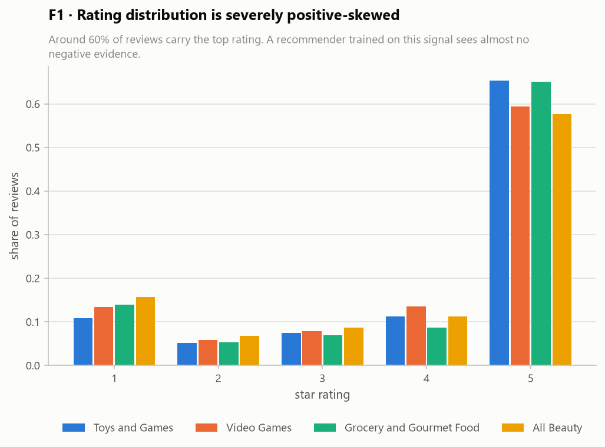

Between 58% and 65% of reviews carry the top rating. Second place is a distant contest:
1★ leads in Grocery (14.0%) and All Beauty (15.7%), 4★ in Toys (11.2%) and Video Games
(13.5%). Either way the distribution is J-shaped and top-heavy.

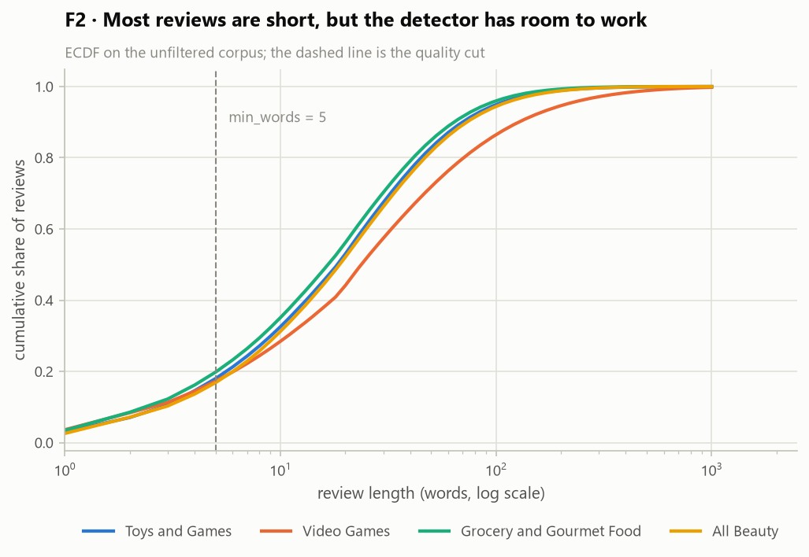

Median review length is 21–27 words. 14.5–17.0% of verified reviews fall under the
five-word threshold and are excluded.

> **Marketing read.** A recommender trained on this signal sees almost no negative evidence,
> which is exactly why a *structural* noise class matters more here than a random one: there
> is no counterweight in the data to correct a mislearned preference. And roughly one in six
> reviewed interactions is undecidable at any cost — a permanent coverage ceiling on any
> text-based detector, worth stating up front rather than discovering later.

### 4.2 Reviewer activity and catalogue concentration

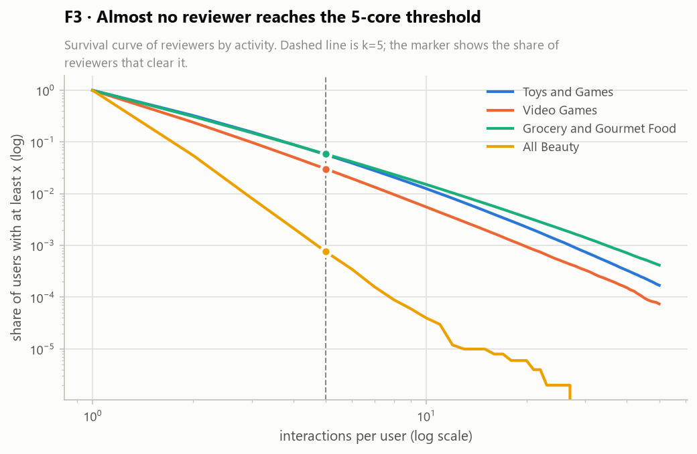

The survival curves are steep. 94–97% of reviewers in the three main categories have fewer
than five interactions; in All Beauty, 99.92% do.

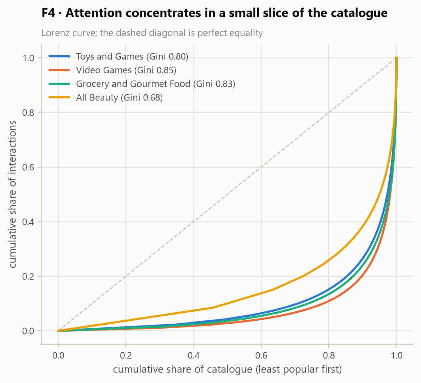

Item popularity is heavily concentrated (Gini 0.68–0.85). The most popular **10% of items
absorbs 74–80%** of all interactions in the three main categories (Video Games 79.6%,
Grocery 76.0%, Toys 73.5%).

> **Marketing read.** These two figures set the stakes from both ends. On the demand side,
> contamination does most damage where personalisation is already weakest: for a customer
> with three recorded interactions, one gift misdirects a third of the signal — the empirical
> basis for marketing metric **M3**. On the supply side, recommendation surfaces have fixed
> capacity (roughly twenty homepage positions, six email slots, one to three retargeting
> placements); when attention is this concentrated, a slot spent on a contaminated
> recommendation displaces a product with genuinely high conversion probability.

### 4.3 Volume over time

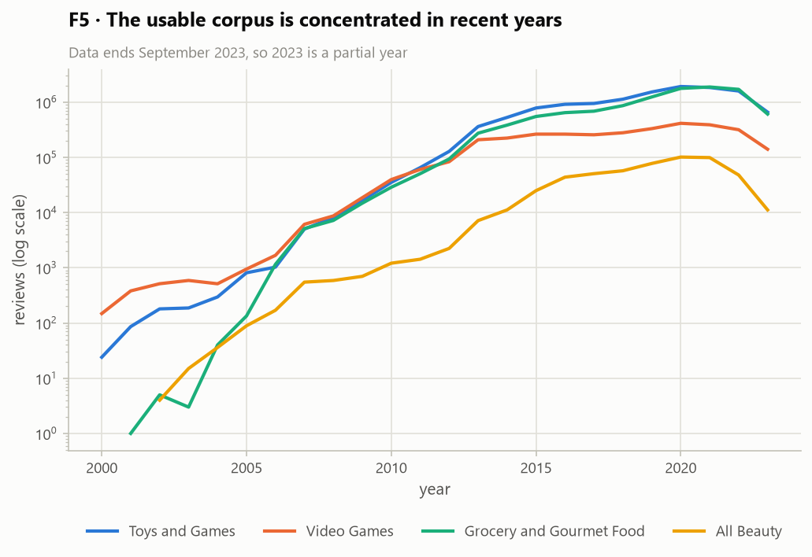

Review volume grows by four orders of magnitude from 2000 to its 2020–2022 peak. The usable
corpus is effectively post-2015.

> **Marketing read.** Any conclusion drawn here describes the recent era, which is the
> relevant one for a personalisation decision today. It also means the annotation sample
> must be drawn with month-level balance, or it will silently become a study of 2021.

### 4.4 ★ Gift prevalence by category — the falsification test

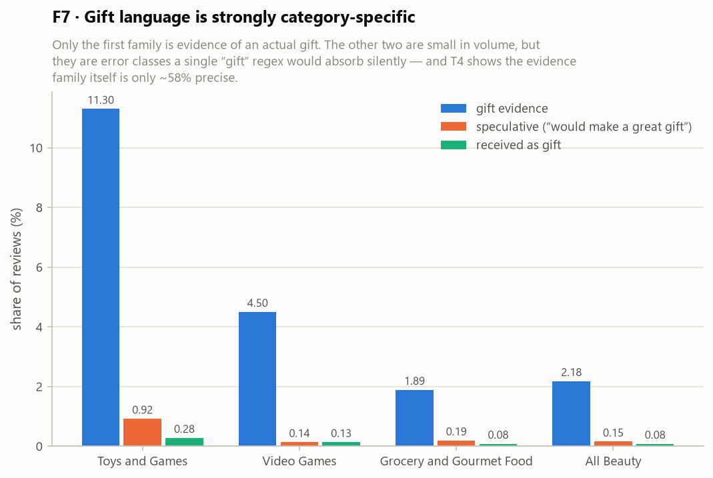

**T3 — lexical gift-proxy rates**

| Category | Reviews | Gift evidence | Speculative | Received | **Proxy rate** |
|---|---|---|---|---|---|
| Toys and Games | 12,417,784 | 11.30% | 0.92% | 0.28% | **11.07%** |
| Video Games | 3,296,440 | 4.50% | 0.14% | 0.13% | **4.40%** |
| All Beauty | 537,261 | 2.18% | 0.15% | 0.08% | **2.13%** |
| Grocery and Gourmet Food | 10,774,599 | 1.89% | 0.19% | 0.08% | **1.85%** |

**The predicted ordering holds: Toys (11.07%) > Video Games (4.40%) > Grocery (1.85%).**
The high-density category shows **six times** the contamination of the control. The
prediction was registered before measurement, and the control category behaved as a control
should.

> **Marketing read.** Contamination is not a uniform tax; it is category-specific and
> plannable. In a toy catalogue, roughly one reviewed interaction in nine is a lower-bound
> estimate of "not this customer's preference." In groceries the number is small enough that
> a personalisation team can reasonably deprioritise it. **This is already an actionable
> allocation decision, before any recommender is trained.**

### 4.5 ★ Seasonality — external validity, obtained without labels

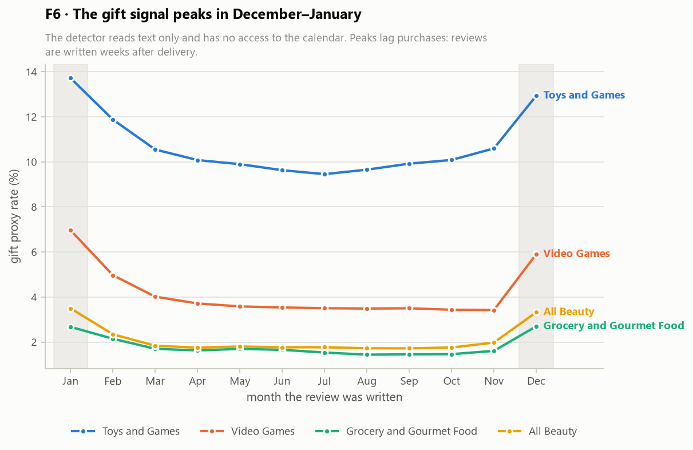

| Category | Jan | Feb | Jun–Sep (trough) | Nov | Dec | Dec ÷ summer |
|---|---|---|---|---|---|---|
| Toys and Games | 13.72% | 11.88% | 9.67% | 10.60% | 12.94% | 1.34× |
| Video Games | 6.97% | 4.97% | 3.51% | 3.42% | 5.90% | 1.68× |
| All Beauty | 3.50% | 2.35% | 1.75% | 1.98% | 3.33% | 1.90× |
| Grocery and Gourmet Food | 2.68% | 2.15% | 1.52% | 1.61% | 2.70% | 1.77× |

**The detector reads text. It has no access to the calendar.** It nonetheless reproduces the
retail gift calendar in all four categories: a December–January maximum, a distinct February
secondary peak, and a summer trough.

**The peak lands in January, and that was predicted in advance.** Review timestamps are not
purchase timestamps — people write weeks after delivery, so a December gifting season
surfaces as a December–January reviewing season. This was stated as an expectation in the
project plan before the data was touched; it is confirmation, not a defect. The February
peak (Valentine's Day) survives the same lag.

One nuance the plan did not anticipate: **seasonal amplitude runs opposite to the base
rate.** Toys has the highest level (11.07%) but the flattest curve (1.34×); All Beauty has a
low base but the sharpest holiday concentration (1.90×). §4.6 explains why.

> **Marketing read.** **Timing:** suppression rules matter most in a December–February
> window, when up to one in seven toy interactions is a gift — and because the *review* peak
> lags the *purchase* peak, a team acting on review-derived signals is acting on a delay it
> must model. **Budget:** retargeting spend placed in January against categories a customer
> entered in December is the highest-risk spend in the calendar. This figure is the direct
> input to marketing metric **M2**.

### 4.6 ★ Who the gifts are for, and when — and why the calendar approach cannot work

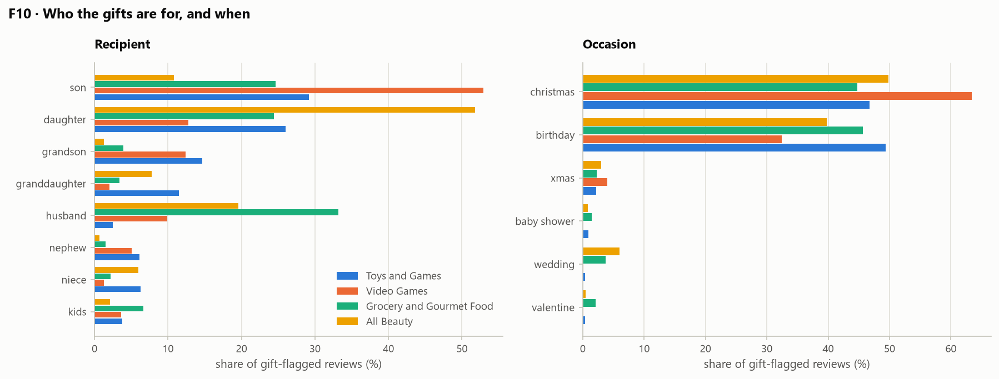

For gift-flagged reviews the recipient relation is recoverable in **78–88%** of cases and a
named occasion in **20–29%** (T5). Among those, the composition is sharply category-specific
(T6):

| Category | Top recipients |
|---|---|
| **Toys and Games** | son 29.1%, daughter 26.0%, **grandson 14.7%, granddaughter 11.5%**, niece 6.3%, nephew 6.1% |
| **Video Games** | **son 49.8%**, daughter 12.0%, grandson 11.6%, husband 9.3%, boyfriend 5.5% |
| **Grocery and Gourmet Food** | **husband 26.0%**, son 19.3%, daughter 19.1%, wife 10.8%, mom 8.9% |
| **All Beauty** | **daughter 38.8%**, husband 14.7%, wife 13.8%, son 8.1%, mom 7.7% |

And the occasions, among reviews that name one:

| Category | Christmas | Birthday | Next largest |
|---|---|---|---|
| Toys and Games | 46.7% | **49.3%** | baby shower 0.9% |
| Video Games | **62.8%** | 32.1% | anniversary 0.5% |
| Grocery and Gourmet Food | 44.4% | **45.2%** | wedding 3.7% |
| All Beauty | **49.6%** | 39.6% | wedding 6.0% |

**This is the most consequential table in the document, and it does two things.**

**First, it settles the project's central methodological argument with a number.** The
closest prior work — Wang et al. (WSDM 2020) — detects gift occasions from the **calendar**.
That approach can only see occasions falling on a shared date. But **birthdays are as large
as Christmas** in three of four categories, and larger in Toys and Games (49.3% vs 46.7%).
Birthdays are spread across all 365 days and are invisible to a calendar model. On these
figures, **a calendar-anchored detector is structurally blind to roughly half of the gift
signal.** Until now the project asserted this; it is now measured. It also explains §4.5:
Toys has the flattest seasonal curve precisely because half its gift volume is birthdays,
which do not cluster in December.

**Second, it exposes a gap in our own annotation schema.** The schema's `recipient` field
(`configs/annotation_schema.json`) offers `child | spouse | parent | friend | colleague |
unknown | null`. But **grandchildren are 26.2% of Toys recipients** and do not map cleanly to
`child`; siblings appear consistently (brother 3.6% in Video Games, sister 5.5% in Grocery)
with no slot at all; and `colleague` — which has a slot — barely registers anywhere. The
schema was designed by intuition. The data says it should gain `grandchild` and `sibling`,
and that `colleague` can fold into `friend`. **This is the schema's first contact with
evidence, and it should be revised before the LLM run, not after.**

*Caveat.* The occasion figure is extracted anywhere in the review, so it may occasionally
catch an incidental mention rather than the purchase occasion. The birthday-vs-Christmas
*ordering* is robust to this; the exact shares are indicative.

> **Marketing read.** Two things a personalisation lead can act on immediately. The gift
> signal in a toy catalogue is overwhelmingly *adults buying for children in their own
> family* — a stable, recurring relationship rather than a one-off event, which means
> suppression rules can be persistent rather than seasonal. And because birthdays are half
> the volume, **any vendor solution sold on "holiday gift detection" addresses at most half
> the problem.**

### 4.7 The rating signature of a gift purchase

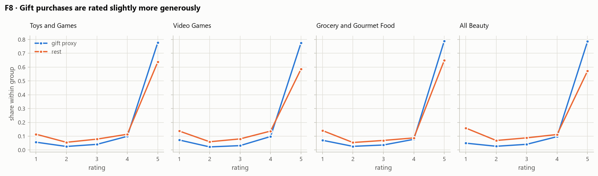

| Category | Gift mean | Rest mean | Difference | Gift 5★ | Rest 5★ |
|---|---|---|---|---|---|
| Toys and Games | 4.517 | 4.104 | **+0.412** | 77.8% | 63.7% |
| Video Games | 4.482 | 3.974 | **+0.508** | 77.6% | 58.6% |
| Grocery and Gourmet Food | 4.490 | 4.049 | **+0.442** | 79.0% | 64.8% |
| All Beauty | 4.542 | 3.870 | **+0.673** | 78.6% | 57.2% |

Gift-flagged purchases are rated consistently and substantially higher — by 0.41 to 0.67
stars — in all four categories.

> **Marketing read.** This behaves exactly as a distinct purchase mode should: a buyer who
> did not use the product cannot criticise it. The consistency across four independent
> categories is corroborating evidence that the flag separates a real behavioural class
> rather than partitioning noise. It also warns anyone using average rating as a quality
> signal — in gift-dense categories that average is partly measuring who was asked, not how
> good the product is.

### 4.8 Where the evidence lives — and a project assumption that does not survive

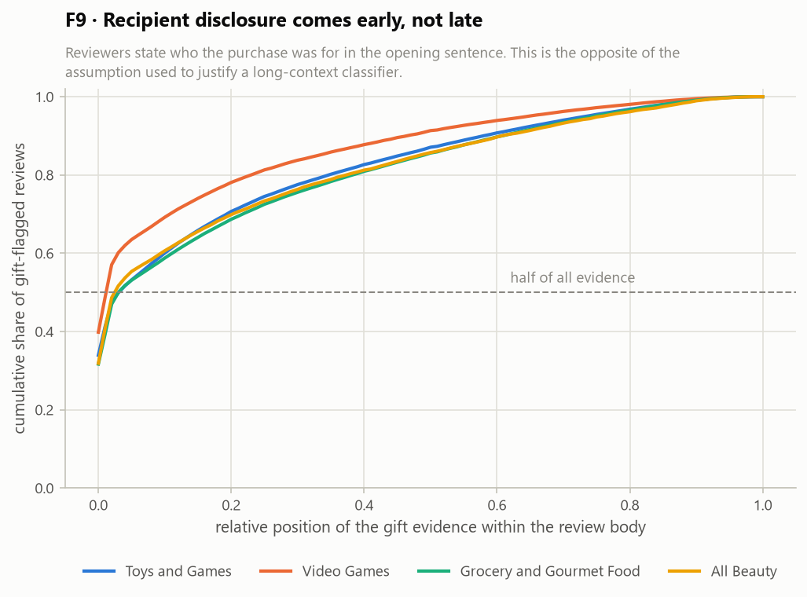

**T5 — detection surface**

| Category | Evidence in title | Median position in body | 90th pct | **Evidence lost @512 tok** | @1024 tok |
|---|---|---|---|---|---|
| Toys and Games | 11.2% | 0.031 | 0.580 | **0.013%** | 0.001% |
| Video Games | 9.8% | 0.011 | 0.464 | **0.044%** | 0.008% |
| Grocery and Gourmet Food | 9.3% | 0.030 | 0.608 | **0.013%** | 0.001% |
| All Beauty | 8.3% | 0.024 | 0.607 | **0.018%** | 0.000% |

Reviewers disclose the recipient **at the very start**. The median gift evidence sits 1–3%
of the way into the review body; 90% of it appears within the first 60%.

**Three project documents justified the choice of ModernBERT partly on its 8,192-token
context, on the stated grounds that "the sentence disclosing the recipient frequently
appears late in a review, after the product discussion." On this corpus that is false.**
(All three have since been corrected; the model choice stands on inference efficiency and
footprint instead. See §5.2.)
Truncating at **512 tokens — plain BERT, the model the argument was made against — would
lose the evidence in fewer than 1 gift review in 2,000.** At the 1,024 tokens our config
actually specifies, the loss is at most 8 in 100,000. Combined with T2 — where only **0.005%–0.19%**
of annotation-corpus reviews exceed 768 words (≈1,024 tokens) — the truncation argument is
not supported by the data.

*Caveat, stated because it matters:* this measures where a **lexical pattern** first
matches, and phrases such as "bought this for my ⟨relation⟩" are plausibly biased toward
review openings. An LLM reading for meaning might find evidence elsewhere. But the margin is
three orders of magnitude — the conclusion does not depend on the caveat.

> **Marketing read.** This is a cost decision, not an accuracy one. A short-context encoder
> is cheaper to run and faster to fine-tune at essentially no measured loss on this corpus.
> The case for ModernBERT should be re-argued on inference efficiency, where it is strong,
> rather than on truncation, where the data does not support it.

### 4.9 ★ Why a keyword scan is not enough — the case for the LLM

The proxy above is deliberately naive. This section measures how naive, because the
project's central technical claim is that this problem *requires* semantic understanding.

**T4 — manual validation, 100 stratified reviews**

| Stratum | n | Labelled `gift_given` | 95% CI | Labelled *not self* (gift + household) | 95% CI |
|---|---|---|---|---|---|
| Flagged by the proxy | 60 | 35 (**58.3%**) | 45.7–69.9% | 49 (**81.7%**) | 70.1–89.4% |
| Speculative language only | 20 | 5 (25.0%) | 11.2–46.9% | 6 (30.0%) | 14.5–51.9% |
| No keyword match at all | 20 | 1 (5.0%) | 0.9–23.6% | 1 (5.0%) | 0.9–23.6% |

> **Disclosure.** This is an **author-assisted preliminary pass**, labelled once against the
> project's four-class schema. It is *not* the three-annotator human validation with Fleiss'
> κ, which remains scheduled for Week 4 of the implementation plan and is the study's actual
> inter-rater evidence. The sample and the scoring tool are in the repository; the team can
> relabel and rescore with one command.

Three findings, each with a direct consequence:

**1. Precision is 58%.** Two in five flagged reviews are not gifts. The failure modes are
readable in the sample. Some are outright false positives: a reviewer enthusing about a
scent she wears herself, adding that her boyfriend adores it, matches a "my ⟨relation⟩ loved
it" pattern while describing her own purchase. Others are near-misses the four-class schema
was designed for — 14 of the 60 are **household** purchases (bought for a spouse or child
with no gift framing), which are not gifts but do not reflect the buyer's own taste either.
Read as a "not the buyer's own preference" detector rather than a gift detector, the same
proxy reaches **81.7%**. *The schema's `household` class is doing real work, and this is the
first empirical support for keeping it.*

**2. The error is not only in the obvious places.** Our audit surfaced a specific,
diagnosable flaw: the phrase *"stocking stuffer"* sits in the evidence family but appears
speculatively about as often as factually. **We have deliberately not patched it.** Tuning
patterns after seeing the validation labels would be fitting to the test set. It is recorded
as a diagnosed limitation and as an input to prompt design.

**3. Recall is the bigger problem, and we can only bound it.** One of 20 reviews with **no
keyword match whatsoever** was a genuine gift — and that single case is itself ambiguous.
With n = 20 the interval is 0.9–23.6%, far too wide to state a recall figure. But the
arithmetic is unforgiving: the unflagged stratum is ~97% of the All Beauty corpus, so even
the *bottom* of that interval implies the lexical scan misses more gifts than it finds. This
is exactly the case the project plan named in advance — *"bought it and my daughter loved
it"* contains no gift vocabulary at all.

Finally, the three pattern families quantify a cheaper mistake. Collapsing them into a
single `gift` regex — the obvious first implementation — inflates the reported rate by
**1.05× to 1.12×** before any precision loss is counted.

> **Marketing read, and the decision this section forces.** A 58%-precision detector deployed
> as a suppression rule would wrongly suppress personalisation for roughly two customers in
> five that it touches. **That is worse than doing nothing**, because it degrades the
> experience of customers who made no gift purchase while claiming to improve it. A lexical
> rule is adequate to *size* the problem — which is what this document uses it for — and
> inadequate to *act* on it. The step to a semantic model is not a technical preference; it
> is the difference between a measurement and a deployable control.

---

*The five analyses that follow test whether the planned experiment can be run on this data,
and what it will be measuring when it is.*

### 4.10 Contamination inside a single customer profile

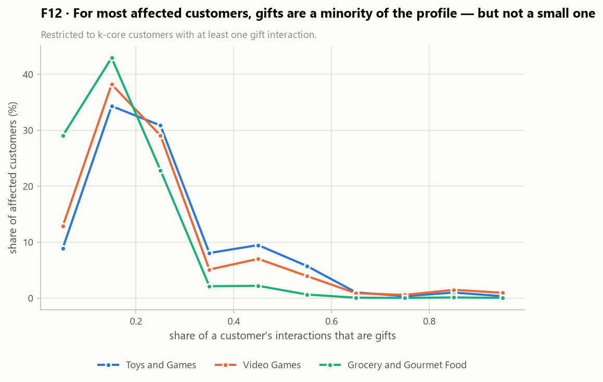

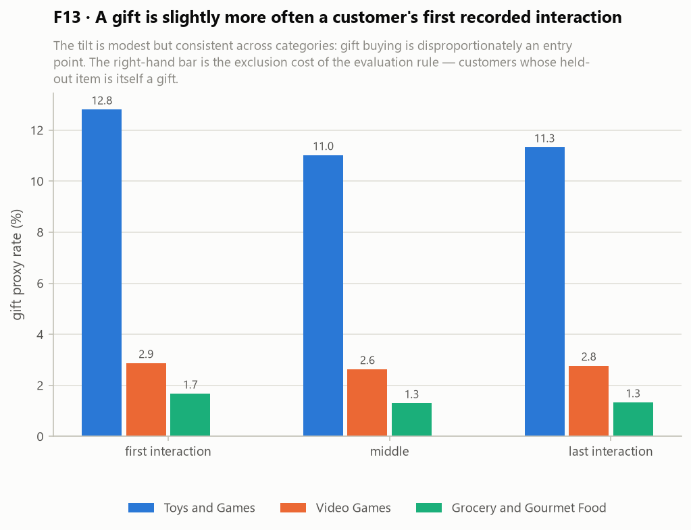

**T7 — sequence feasibility, computed on the k-core (experimental) corpus**

| Category | Users in k-core | With ≥1 gift | Last item is a gift | Entire sequence is gifts | **Eval-eligible** | Mean contamination among affected |
|---|---|---|---|---|---|---|
| Toys and Games | 268,652 | 128,546 (**47.8%**) | 11.32% | 0.146% | **88.7%** | 24.2% |
| Video Games | 47,663 | 5,958 (12.5%) | 2.77% | 0.109% | **97.2%** | 22.5% |
| Grocery and Gourmet Food | 268,991 | 25,767 (9.6%) | 1.33% | 0.003% | **98.7%** | 14.7% |
| All Beauty | 0 | — | — | — | n/a — no k-core | — |

Four results the experiment needs:

- **Nearly half of Toys customers (47.8%) are affected** by at least one gift interaction.
  There is ample signal for RQ2 to detect an effect if one exists.
- **Among affected customers, gifts are 14.7%–24.2% of the profile on average** — a
  meaningful minority, consistent with the sparse-profile argument in §4.2.
- **The evaluation rule is cheap.** The mandatory "test item must be a self-purchase" rule
  costs only **1.3% to 11.3%** of customers. This was an open risk in the plan; it is now a
  known, small number.
- **The "entire sequence is a gift" edge case is negligible** — 0.003%–0.146%. The plan
  flagged it as something to handle; simple exclusion suffices.

F13 adds a modest but consistent tilt: a gift is slightly *more* likely to be a customer's
**first** recorded interaction (12.8% in Toys) than a middle (11.0%) or last (11.3%) one.

> **Marketing read.** Gift buying is disproportionately an *entry point* into a category —
> the first thing the platform ever learns about a customer is, more often than the base
> rate, something that customer does not want. That is the worst possible position for a
> contaminated signal to occupy, and it is precisely the scenario the Amazon patents describe
> as most damaging.

### 4.11 What 5-core filtering does to the signal — a warning for the experiment

**T8 — contamination rate, full corpus versus experimental corpus**

| Category | Clean corpus | k-core corpus | **Shift** |
|---|---|---|---|
| Toys and Games | 11.07% | 11.27% | **+1.8%** |
| Video Games | 4.40% | 2.68% | **−39.2%** |
| Grocery and Gourmet Food | 1.85% | 1.34% | **−27.5%** |
| All Beauty | 2.13% | — | no k-core |

**5-core filtering systematically removes gift buyers** in two of the three viable
categories. The mechanism is easy to see once measured: a gift purchase is often a one-off —
you buy a nephew a game, review it, and never return to the category — and one-off reviewers
are precisely who *k*-core deletes.

The consequence for the experiment is direct and was not anticipated in the plan: **the
recommender experiment will run on a corpus 27–39% less contaminated than the one we
measured**, in Video Games and Grocery. The experiment is therefore biased *toward finding
no effect* in exactly the two categories where the effect was already expected to be small.
Toys and Games is the exception — contamination survives *k*-core intact (+1.8%) — which
makes it the correct primary category for RQ2, not merely the most gift-dense one.

> **Marketing read.** A methodological caution that generalises well beyond this study: the
> standard preprocessing recipe of recommender-systems research **preferentially deletes the
> very customers whose data is most contaminated**. Any team measuring data-quality effects
> on a *k*-cored benchmark is measuring them on an unrepresentative sample, and should say
> so.

### 4.12 The sequences are only partly purchase sequences

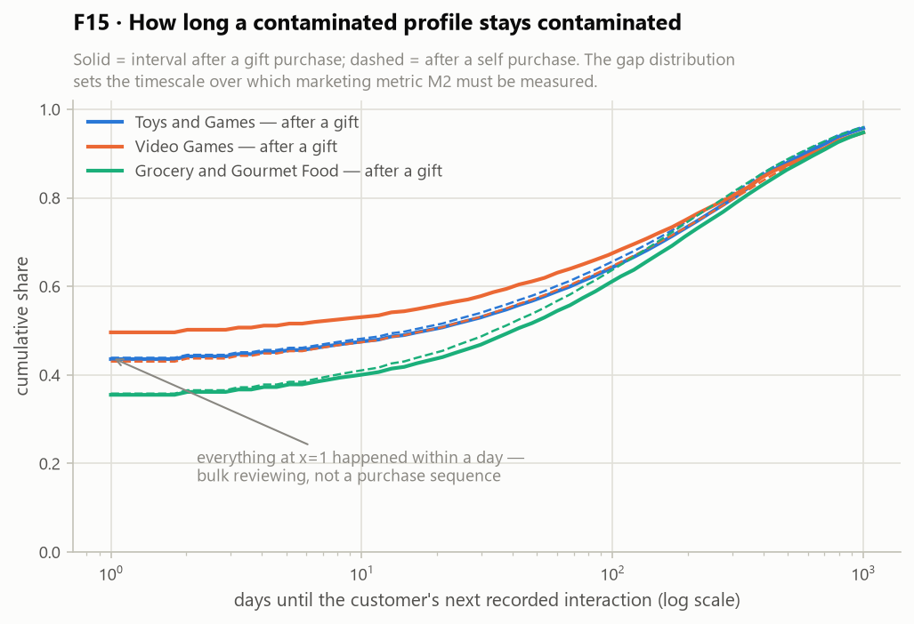

**T11 — temporal resolution**

| Category | Consecutive pairs on the same day | Median gap | **Held-out item same day as previous** | Median gap before held-out item |
|---|---|---|---|---|
| Toys and Games | **43.0%** | 15 days | **31.2%** | 93 days |
| Video Games | **42.3%** | 17 days | **31.5%** | 101 days |
| Grocery and Gourmet Food | **34.8%** | 34 days | **24.5%** | 99 days |

**Between a third and 43% of consecutive interactions occur on the same calendar day**, and
22–29% of customer-days contain more than one review. People review in batches: they sit
down and write up several past purchases at once.

For a sequential recommender evaluated leave-one-out, this matters. In **24.5%–31.5% of
customers, the held-out "next" item shares its date with the previous interaction** — so the
model is not being asked to predict a future purchase but another item from the same
reviewing session. That is a different, easier task.

This does not invalidate the experiment. It does mean the results table should carry a
robustness column computed on the subset whose held-out item is genuinely later — the median
gap before the held-out item is 93–101 days, so a clean majority of the evaluation is
well-separated. **Reporting it is the difference between a defensible result and one that
falls apart under the first informed question.**

> **Marketing read.** Review timestamps are a *reviewing* clock, not a *purchasing* clock.
> Any duration expressed in this data — including marketing metric **M2**, contamination
> half-life — inherits that distortion and must be reported as "weeks of review activity",
> not "weeks of customer life".

### 4.13 Item concentration and cross-category reach

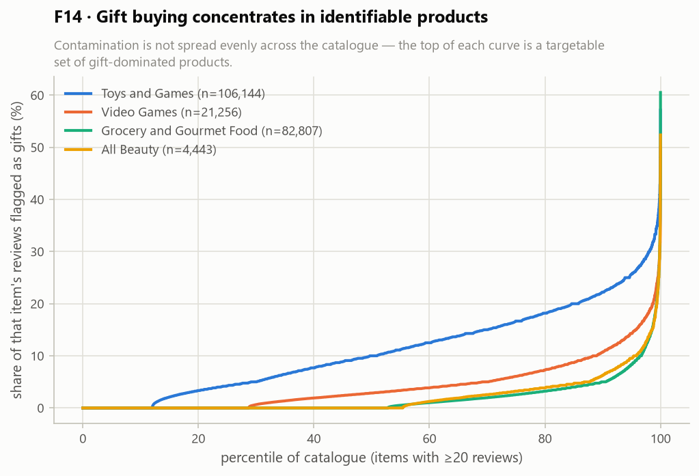

Contamination is not spread evenly across the catalogue. Restricted to items with at least
20 reviews, the per-item gift rate spans the full range: a long tail of products is barely
gift-bought, while the top of each curve is a dense, identifiable set of gift-dominated
products.

**T10 — cross-category customers**

| Metric | Value |
|---|---|
| Distinct customers across all four categories | 12,690,408 |
| Customers observed in **≥2** categories | **2,316,411 (18.3%)** |
| …of those, entered **≥1 category only via a gift** | **207,155 (8.9%)** |
| Customers present in all four categories | 15,162 |

`user_id` is **global across categories** in Amazon Reviews 2023 — verified, not assumed.
That makes marketing metric **M1** (wasted personalisation inventory: slots drawn from
categories a customer entered *only* via a gift) computable from this data, which was
previously an open question. The population is now sized: **8.9% of multi-category customers
have at least one category in their profile that exists purely because of a gift.**

> **Marketing read.** Both halves are directly operational. Item-level concentration means a
> retailer can maintain a **gift-dominated product list** and apply suppression at the
> product level — no per-customer inference, and therefore no household-composition
> profiling. That is the cheapest intervention available and the one that best respects the
> ethical line drawn in §3.6. And the cross-category figure is the first direct estimate of
> M1's reach: for roughly one multi-category customer in eleven, an entire interest category
> on their profile is an artefact of a gift.

### 4.14 Confound and robustness checks

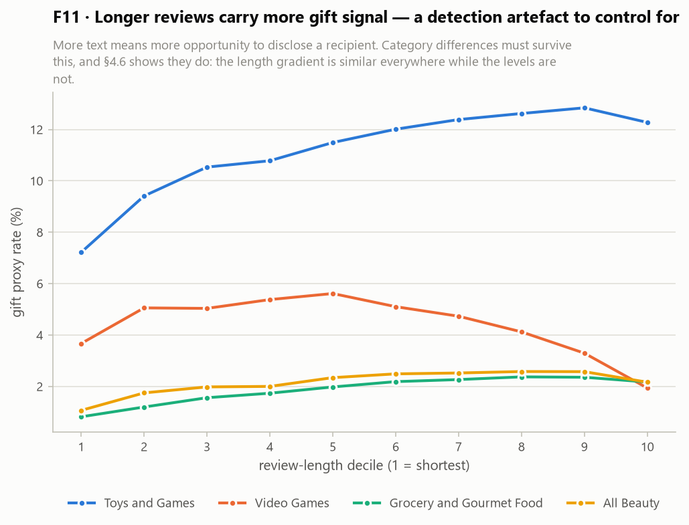

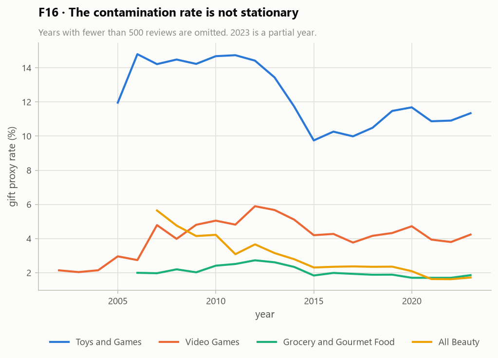

**T9 — confounds**

| Category | Gift rate, shortest 20% | Gift rate, longest 20% | Ratio | Unverified (raw) | Non-ASCII | Dup. text raw → filtered |
|---|---|---|---|---|---|---|
| Toys and Games | 8.23% | 12.56% | 1.53× | 8.6% | 11.75% | 15.90% → 3.47% |
| Video Games | 4.38% | 2.64% | **0.60×** | 13.9% | 8.19% | 14.67% → 2.30% |
| Grocery and Gourmet Food | 0.96% | 2.27% | 2.36× | 8.0% | 10.92% | 14.89% → 1.96% |
| All Beauty | 1.39% | 2.37% | 1.70× | 9.5% | 14.83% | 10.09% → 0.49% |

**Length is a genuine confound, and it is reported rather than hidden.** Longer reviews
contain more gift signal in three of four categories (1.5×–2.4×), for the obvious reason
that more text means more opportunity to disclose a recipient. The category ordering in §4.4
survives it: the gradient is similar across categories while the levels differ by 6×, so
length cannot be what separates Toys from Grocery.

**Video Games inverts the gradient (0.60×)** — its *shortest* reviews carry the most gift
signal. The likely mechanism is visible in the corpus: a short Video Games review is often a
complete gift statement ("Bought for my son, he loves it"), while a long one is a detailed
gameplay critique, which is a self-purchase. This is a category-specific quirk worth knowing
before interpreting any Video Games result, and the kind of thing that only appears if you
look.

**The rate is not stationary** (F16). Gift prevalence drifts across years in every category.
Absolute figures are therefore period estimates, not constants — relevant given that the
data ends in September 2023.

> **Marketing read.** The honest summary: the *level* of contamination is category-specific,
> time-varying, and partly a function of how much customers write — while the *ordering*
> between categories is robust to all three. Act on the ordering; treat any single percentage
> as an estimate with a date on it.

---

## 5. Conclusion

### 5.1 Is the data suitable for the next stage?

**Yes for detection, yes for the experiment in three of four categories, and no for the
pilot category as an experimental site.**

| Requirement | Verdict | Evidence |
|---|---|---|
| Enough text to detect gift intent | **Yes** | Median 21–27 words; 83–86% of verified reviews clear the 5-word floor |
| Gift signal actually present | **Yes** | 1.85%–11.07% by lexical lower bound, 6× spread across the designed spectrum |
| Detector separates a real class | **Yes — four independent checks** | Category ordering as predicted (§4.4); seasonality without calendar access (§4.5); distinct rating distribution (§4.7); coherent recipient composition (§4.6) |
| Timestamps usable for seasonality | **Yes** | Millisecond units confirmed; zero out-of-range rows |
| Sequences usable for sequential recommendation | **Yes in 3 of 4, with a caveat** | 0.37M–2.43M interactions after 5-core; but 24.5–31.5% of held-out items share a date with the previous interaction (§4.12) |
| Evaluation rule affordable | **Yes** | "Test item must be self" costs only 1.3–11.3% of customers (§4.10) |
| Marketing metric M1 computable | **Yes** | `user_id` is global across categories; 8.9% of multi-category customers qualify (§4.13) |
| Pilot category usable for the experiment | **No** | `All_Beauty` retains 0 interactions after 5-core |
| Lexical detection sufficient on its own | **No** | 58% precision; recall bounded but clearly poor (§4.9) |
| Long-context classifier necessary | **No** | Evidence lost at 512 tokens: 0.013–0.044% (§4.8) |

### 5.2 What this changes in the project plan

Six concrete revisions, in descending order of importance. All six have been applied to
the project's other deliverables and to the repository configuration; each is recorded with
its rationale in `repo/docs/DECISIONS.md`.

1. **`All_Beauty` is retired as the experimental pilot** and retained as the
   detector-development pilot, where its 537K reviews and 32-second download remain ideal.
   The recommender experiment pilots on **Video Games** — at 368K interactions after
   5-core it is the smallest viable category and the fastest to iterate on.
2. **Toys and Games becomes the primary category for RQ2**, not merely the most gift-dense
   one. It is the only category where contamination survives 5-core intact (§4.11); in the
   other two the experiment would run on a corpus 27–39% cleaner than reality, biased toward
   a null result.
3. **The annotation schema is revised before the LLM run** (§4.6). `recipient` gains
   `grandchild` — 26.2% of named Toys recipients, and the distinction that carries the
   `household` / `gift_given` boundary, since a grandchild lives in a different household
   while one's own child does not — plus `sibling` and `extended_family`; `spouse` widens to
   `partner` (5.5% of Video Games recipients are a boyfriend or girlfriend); the near-empty
   `colleague` folds into `friend`. `occasion` gains the five occasions the data actually
   contains. The prompt now states that `unknown` is the expected occasion for most reviews,
   since occasion is lexically recoverable only 20–29% of the time.
4. **The results table gains a same-day robustness column** (§4.12). A quarter to a third of
   the evaluation is same-session prediction rather than next-purchase prediction.
5. **The distillation context-length argument is restated** (§4.8). ModernBERT remains
   defensible on inference efficiency and on a 149M-parameter footprint that fits the
   available GPU; it is not defensible on truncation, and `distill.max_length: 1024` is more
   than sufficient. DeBERTaV3-base is added as a robustness check, since sample efficiency
   matters more than training speed at 40–60K labels.
6. **Two corpora per category are now standard**: `clean` for detection and descriptive
   analysis, `kcore` for the experiment. The rule that the user/item universe freezes once,
   on the baseline condition, applies to `kcore` and is unaffected.

**A seventh revision came from outside this analysis but belongs with them.** Selecting the
annotator LLM against measured hardware — every GPU available to the team is pre-Ampere —
replaced the previously specified 9B hybrid-attention model, which cannot in practice be
served on that hardware, with **Qwen3-4B-Instruct-2507**. This analysis supplies the evidence
that 4B is adequate: the evidence sits early in the text (§4.8) and a naive lexical proxy
already reaches 58.3% precision (§4.9), so the model's task is to correct a characterised
error pattern rather than to find a signal from nothing.

### 5.3 What the data already supports

Before a single model is trained, this analysis yields marketing-actionable results:

- **Gift contamination ranges from under 2% in groceries to at least 11% in toys**, rises by
  a third to a half in the December–February window, and concentrates in customer profiles
  too sparse to absorb it. Every figure is a lower bound.
- **Roughly half the gift signal is birthdays, not holidays** — so calendar-based occasion
  detection, the deployed industry alternative, is structurally blind to about half the
  problem. This is the project's differentiating claim, now measured rather than argued.
- **Gift buying is disproportionately a customer's entry point into a category**, and for
  8.9% of multi-category customers at least one interest category exists purely because of a
  gift.
- **Contamination concentrates in identifiable products**, so a product-level suppression
  list is a viable intervention requiring no household-composition inference at all — the
  cheapest and most privacy-respecting option on the table.

That is enough to tell a personalisation team where to look and what kind of remedy to
consider. It is not enough to tell them whether the remedy works — which is the question the
recommender experiment exists to answer, and which requires a detector considerably better
than the one used here.

---

## 6. References

**Dataset**

1. Hou, Y., Li, J., He, Z., Yan, A., Chen, X., & McAuley, J. (2024). Bridging Language and Items for Retrieval and Recommendation. arXiv:2403.03952 · https://amazon-reviews-2023.github.io/ · https://huggingface.co/datasets/McAuley-Lab/Amazon-Reviews-2023

**Recommender systems and evaluation**

2. Rendle, S., Freudenthaler, C., Gantner, Z., & Schmidt-Thieme, L. (2009). BPR: Bayesian Personalized Ranking from Implicit Feedback. *UAI 2009*, 452–461.
3. Kang, W.-C., & McAuley, J. (2018). Self-Attentive Sequential Recommendation. *ICDM 2018*, 197–206. https://doi.org/10.1109/ICDM.2018.00035
4. Krichene, W., & Rendle, S. (2020). On Sampled Metrics for Item Recommendation. *KDD '20*, 1748–1757.
5. Ferrari Dacrema, M., Cremonesi, P., & Jannach, D. (2019). Are We Really Making Much Progress? A Worrying Analysis of Recent Neural Recommendation Approaches. *RecSys '19*, 101–109. https://doi.org/10.1145/3298689.3347058

**Denoising and occasion-aware recommendation**

6. Wang, W., Feng, F., He, X., Nie, L., & Chua, T.-S. (2021). Denoising Implicit Feedback for Recommendation. *WSDM '21*, 373–381. https://doi.org/10.1145/3437963.3441800
7. Wang, J., Louca, R., Hu, D., Cellier, C., Caverlee, J., & Hong, L. (2020). Time to Shop for Valentine's Day: Shopping Occasions and Sequential Recommendation in E-commerce. *WSDM '20*, 645–653. https://doi.org/10.1145/3336191.3371836

**LLM annotation, validation, and encoders**

8. Gilardi, F., Alizadeh, M., & Kubli, M. (2023). ChatGPT outperforms crowd workers for text-annotation tasks. *PNAS*.
9. Pangakis, N., Wolken, S., & Fasching, N. (2023). Automated Annotation with Generative AI Requires Validation. arXiv preprint.
10. Calderon, N., Reichart, R., & Dror, R. (2025). The Alternative Annotator Test for LLM-as-a-Judge. *ACL 2025*, 16051–16081.
11. Warner, B., et al. (2025). Smarter, Better, Faster, Longer: A Modern Bidirectional Encoder for Fast, Memory Efficient, and Long Context Finetuning and Inference. *ACL 2025*, 2526–2547. arXiv:2412.13663

**Industry context**

12. Amazon Technologies, Inc. US Patents 9,818,145; 10,445,809; 8,352,331; 11,367,117 — cited as documentary evidence of industry problem recognition, not of measured effect.
13. Gift recommendation systems: a review. (2023). *Electronic Commerce Research*. https://doi.org/10.1007/s10660-023-09790-6

**Tooling**

14. polars — DataFrame library. https://pola.rs/
15. HuggingFace `huggingface_hub` documentation. https://huggingface.co/docs/huggingface_hub
16. Dataset scripts deprecation, `datasets` 4.x. https://github.com/huggingface/datasets/issues/7693

---

## Appendix — reproducing this document

| Artefact | Path |
|---|---|
| Pipeline code | `repo/src/gift_contamination/` |
| Configuration (single source of truth) | `repo/configs/base.yaml`, `repo/configs/gift_keywords.yaml` |
| Preprocessing funnel counts | `repo/reports/results/preprocess_funnel_*.json` |
| Lexical proxy rates | `repo/reports/results/keyword_rates_*.json` |
| Corpus tables (T1–T3) | `repo/reports/results/eda_tables.md` |
| Manual validation (T4) | `repo/reports/results/keyword_precision.json` |
| Deep-analysis tables (T5–T14) | `repo/reports/results/deep_eda_tables.md` |
| All figures (F1–F16) | `repo/reports/figures/` and `figures/` |
| Interactive walkthrough | `repo/notebooks/01_data_research_eda.ipynb` |
| Deviations from the project specification | `repo/docs/DECISIONS.md` |
| Data-integrity tests | `repo/tests/` — `pytest tests -q` |

> **AI authorship disclosure.** In line with the disclosure in the Implementation Plan, this
> document was drafted with substantial assistance from a large language model (Claude,
> Anthropic). All figures and statistics are produced by the team's own code from the raw
> dataset and are reproducible with the commands above; the T4 labelling is disclosed as an
> author-assisted preliminary pass in §4.9.
