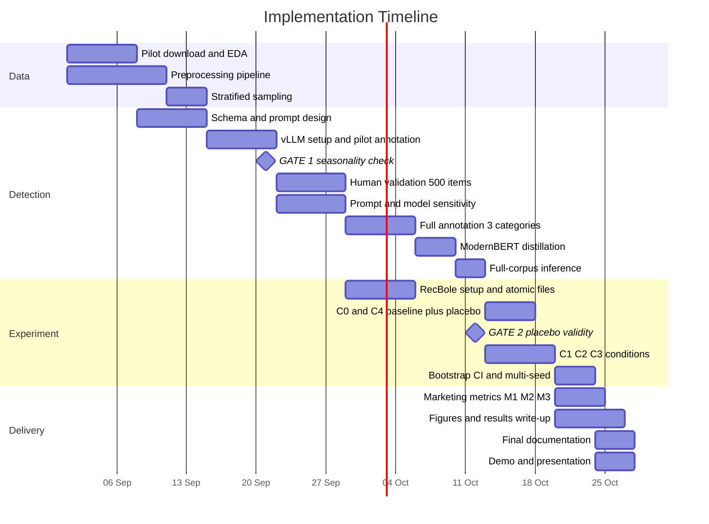

# Implementation Plan

**AI in Marketing Capstone**
**Project:** *This Was Not For Me — Detecting Gift Purchases as a Distinct Class of Noise in E-Commerce Recommender Systems*

**Team Members:** [Team Member 1] / [Team Member 2] / [Team Member 3]

---

## 1. Technology Stack

Every component is free and open-source. **Total project cost: $0.** No commercial API, paid dataset, cloud GPU, or credit card is required at any stage.

### 1.1 Environment and language

| Component | Selection | Purpose |
|---|---|---|
| Language | Python 3.10+ | All pipeline code |
| Development | VS Code, Jupyter (local); **Kaggle Notebooks** (free) for GPU work | Local machine handles data processing, distillation and all experiments. The LLM annotation run executes on Kaggle — see §1.6 |
| Version control | Git + GitHub | Submission target; also the reproducibility record |
| Environment isolation | `venv` — **two separate environments** | RecBole's pinned dependencies conflict with vLLM's; separation is cheaper than resolution |

### 1.2 Data layer

| Component | Selection | Purpose |
|---|---|---|
| Dataset access | `huggingface_hub.hf_hub_download` | Direct category-shard download of Amazon Reviews 2023. **Not** `datasets.load_dataset(..., trust_remote_code=True)`: `datasets` 4.0 removed that parameter and 4.5 removed loading-script support entirely, so the dataset's own documented quickstart no longer runs. Verified during Data Research |
| Large-scale processing | **polars** | Chosen over pandas for multi-million-row operations — materially faster and more memory-efficient |
| Storage format | Parquet (via `pyarrow`) | Columnar intermediate artefacts |
| Schema validation | **Pydantic v2** | Enforces the annotation schema; malformed LLM output rejected at the boundary, not downstream |

### 1.3 AI / ML layer

| Component | Selection | Purpose |
|---|---|---|
| **Annotator LLM (primary)** | **Qwen3-4B-Instruct-2507**, float16 (unquantised) | Gift detection from review text. Dense, text-only, standard grouped-query attention — the property that lets it run on pre-Ampere GPUs (§1.6). Non-thinking, so no token budget is spent deliberating a four-way label |
| **Annotator LLM (secondary)** | **Gemma 4 E4B** on a ~5K subsample | Cross-model agreement measurement — *not* redundancy. Different laboratory and pretraining corpus, which is what makes the agreement statistic informative. Fallback: Gemma 3 4B-it |
| **Serving** | **vLLM** with guided JSON decoding, `--dtype float16` | PagedAttention delivers 2–4× throughput at equal latency (Kwon et al., 2023); schema-constrained decoding removes parse failure as an error class. float16 is mandatory, not preference: bfloat16 requires compute capability 8.0 |
| **Distillation target** | **ModernBERT-base** | Inference efficiency at corpus scale plus a 149M-parameter footprint that fits the local 4 GB GPU. Explicitly *not* selected for its 8,192-token context — measurement showed a 512-token limit would lose the evidence in only 0.013–0.044% of gift reviews (Data Research §4.8). DeBERTaV3-base retained as a robustness check if the fidelity gate is missed |
| Training | HuggingFace `transformers` + `accelerate` | Encoder fine-tuning |
| **Recommenders** | **RecBole** — SASRec, BPR, ItemKNN, GRU4Rec, Pop | Unified protocol; results comparable to published figures |
| Classical ML / stats | scikit-learn, scipy, statsmodels | Agreement statistics, bootstrap intervals, significance tests |

### 1.4 Analysis, tracking and presentation

| Component | Selection | Purpose |
|---|---|---|
| Experiment tracking | **Weights & Biases** (free tier) | ~30–75 runs across conditions, models, seeds — infeasible to track manually |
| Visualisation | matplotlib, seaborn | Seasonality curve, Qini-style decay plots, condition comparisons |
| Annotation interface | Streamlit (local) or shared spreadsheet | 500-item human validation; a spreadsheet is sufficient and is the fallback |
| Configuration | YAML | Single source of truth; no hard-coded paths or parameters |
| Documentation | Markdown, Mermaid diagrams | Renders natively on GitHub |

### 1.6 Hardware reality and where each stage runs

The stack above was originally specified against an assumed "consumer GPU." Measuring the hardware the team actually has changed which stages can run where, and this table now governs the schedule in §2.

| | Local workstation | Kaggle free tier |
|---|---|---|
| GPU | GTX 1650 Ti, 4 GB, Turing (sm75) | 2× Tesla T4, 16 GB each, Turing (sm75) |
| System RAM | 16 GB | 30 GB |
| OS | Windows 11 | Linux |
| Quota | Unlimited | ~30 GPU-hours/week, 12 h per session |

Three consequences, each of which changes a plan item rather than merely describing a limitation:

1. **The annotation run cannot execute locally.** 4 GB does not hold a 4B model in float16, and vLLM is not supported natively on Windows. Kaggle is therefore the annotation environment by design, not a contingency. Colab (T4) is the interchangeable substitute if Kaggle quota runs out mid-week.
2. **Every available GPU is pre-Ampere.** No bfloat16, no FlashAttention kernels. This excludes the current flagship small-model families on kernel support rather than capability, and is the reason the annotator is Qwen3-4B-Instruct-2507 rather than a 2026-generation hybrid-attention model. Technology Review §4.2 documents the comparison.
3. **Everything except annotation runs locally and comfortably.** Preprocessing is polars on CPU; ModernBERT-base fine-tunes and runs inference within 4 GB; RecBole experiments on the filtered corpus are CPU/small-GPU workloads. Only one of six stages depends on the metered quota, which is what keeps a ~30 h/week ceiling from becoming the schedule's critical path.

**Local smoke testing.** Prompt iteration and schema debugging use a 4-bit GGUF build of the same model under llama.cpp, which runs on Windows within 4 GB. No label produced this way enters the dataset; it exists so that a broken prompt is discovered before it consumes Kaggle quota.

### 1.5 What is deliberately excluded

This is a research pipeline, not a deployed product. The following are **out of scope** and their exclusion is a design decision, not an omission:

| Excluded | Reason |
|---|---|
| Docker | GPU containerisation adds meaningful setup friction for a three-person team with no deployment target |
| CI/CD | Nothing is deployed; tests are run locally |
| Database | Parquet files on disk are sufficient; no concurrent access requirement |
| REST API / serving stack | No live inference requirement |
| Commercial LLM APIs | Customer text would leave the environment; model deprecation breaks reproducibility; budget is zero |

---

## 2. Timeline and Task Distribution

### 2.1 Timeline

**Note on dates.** This plan begins the week following Concept Note submission (30 August 2026). The final capstone deadline is **[TBD — to be confirmed with programme coordination]**; the eight-week schedule below should be compressed or extended once that date is fixed. Two hard decision gates (Weeks 3 and 6) are positioned so that a failing pipeline is abandoned or redirected early rather than late.

### 2.2 Week-by-week detail

| Week | Focus | Exit condition |
|---|---|---|
| **1** | ✅ *Complete.* All four categories downloaded (16.3 GB), preprocessing pipeline, deep EDA (16 figures, 15 tables), naive keyword scan, 100-item precision check | Gift rates estimated per category; **category choice revised** — All Beauty dropped as experimental pilot (empty 5-core), Toys and Games promoted to primary. See §4.6 |
| **2** | Annotation schema, prompt v1, manual trial on 200 reviews, schema revision | Stable schema; prompt guideline-heavy, few-shot-light |
| **3** | vLLM setup, 10K pilot annotations, first monthly rate curve | 🚦 **GATE 1** — see §2.3 |
| **4** | 500-item human annotation (all three members), κ and per-class F1, sensitivity analysis | Detector validated or returned to Week 2 |
| **5** | Full annotation across three categories, ModernBERT distillation, full-corpus inference | Every interaction labelled with confidence score |
| **6** | RecBole configuration, atomic files, C0 and C4 runs | 🚦 **GATE 2** — see §2.3 |
| **7** | C1, C2, C3 conditions; bootstrap intervals; multi-seed repeats | Complete results table with confidence intervals |
| **8** | Marketing metrics, figures, documentation, presentation | Submission-ready |

### 2.3 Decision gates

**🚦 Gate 1 — End of Week 3: Does the detector work?**
*Criterion:* monthly gift rate shows a **December–January** elevation above the annual mean, and the naive-versus-LLM comparison shows the LLM capturing cases keywords miss.
*Why December–January and not November–December:* review timestamps lag purchase timestamps, and the lexical proxy run in Week 1 places the peak in December–January in all four categories (Data Research §4.5, T14). Holding the detector to a November peak would reject a working detector.
*If failed:* revise prompt (open `prompts/gift_detection_v2.md`), switch primary model, or change category. **Do not proceed to full annotation.** Budget: one week to recover, then escalate to the fallback in §4.

**🚦 Gate 2 — End of Week 6: Is the experiment valid?**
*Criterion:* C0 versus C4 shows **no** statistically significant difference.
> **Erratum — 2026-09-20 (audit).** This criterion was **reformulated before the runs**
> (2026-09-14, `configs/base.yaml` → `gate2`) to "the placebo must not *beat* C0"
> (lower CI bound ≤ 0). Deleting random interactions is expected to *hurt* accuracy, so
> demanding no difference at all would fail a correct setup — and did: Toys × SASRec has
> C4 − C0 = −0.851 pt [−0.916, −0.789]. The binding four criteria, all four PASS, are in
> `repo/docs/SONUCLAR.md` §3. The same superseded wording also appears in `concept-note`
> §5, `repo/docs/ROADMAP.md` and `repo/docs/PROJECT_SPEC.md`.
*If failed:* the setup is broken — most likely the user/item universe is not frozen across conditions, or the temporal split leaks. **Do not interpret any downstream result** until resolved. Budget: three days to diagnose.

### 2.4 Task distribution matrix

Three lanes, balanced by effort. Each lane owns a capstone deliverable section, which prevents the common failure of everyone coding and nobody writing.

| Task | Lane A — Data & Detection | Lane B — Validation & Analysis | Lane C — Recsys & Experiment |
|---|:---:|:---:|:---:|
| Dataset download and preprocessing | **R** | C | I |
| Stratified sampling | **R** | C | I |
| Annotation schema design | **R** | **R** | C |
| Prompt engineering | **R** | C | I |
| vLLM setup and annotation runs | **R** | I | I |
| **Human annotation (500 items)** | **R** | **R** | **R** |
| Agreement statistics, per-class F1 | C | **R** | I |
| Prompt/model sensitivity analysis | C | **R** | I |
| Seasonality and category analysis | I | **R** | I |
| ModernBERT distillation | **R** | C | I |
| Full-corpus inference | **R** | C | C |
| RecBole setup and atomic files | I | I | **R** |
| Experimental conditions C0–C4 | C | I | **R** |
| Statistical testing, bootstrap CI | I | C | **R** |
| Marketing metrics M1–M3 | I | C | **R** |
| **Owned write-up section** | Technology Review (NLP) | **Data Research** | Technology Review (recsys) + Results |

**R** = Responsible · **C** = Consulted · **I** = Informed

**If the team is two rather than three:** merge Lane A and Lane B for detection work, with the second member taking Lane C plus the Data Research write-up. The 500-item annotation then requires a third annotator from outside the team — agreement statistics are meaningless with two raters, and this cannot be worked around.

---

## 3. Milestones and Deliverables

| # | Milestone | Evidence of completion | Target week |
|---|---|---|---|
| **M1** | **Data ready** | Preprocessed Parquet for three categories; `test_preprocess.py` passing; row counts and 5-core statistics reported in EDA notebook | 2 |
| **M2** | **Detector prototype working** | 10K pilot annotations; JSON parse failure rate < 1%; monthly rate curve plotted | 3 |
| **M3** | 🚦 **Detector validated** | 500 human-annotated items; Fleiss' κ reported; per-class precision/recall/F1 table; error analysis of top failure modes | 4 |
| **M4** | **Sensitivity quantified** | Four-configuration comparison table (2 prompts × 2 models); prevalence range reported as an interval, not a point | 4 |
| **M5** | **Corpus labelled** | Every interaction in all three categories carries `purchase_type` + confidence; distillation fidelity within 5 pp of LLM | 5 |
| **M6** | **RQ1 answered** | Gift prevalence by category and month with confidence intervals; seasonality figure; category-ordering check documented | 5 |
| **M7** | **Baseline established** | C0 results for SASRec and BPR under full ranking; comparable to published figures for the same datasets | 6 |
| **M8** | 🚦 **Experiment validity confirmed** | C0 vs C4 comparison showing no significant difference; `test_conditions.py` and `test_no_leakage.py` passing | 6 |
| **M9** | **RQ2 and RQ3 answered** | Complete C0–C4 results table; bootstrap CIs across 3–5 seeds; effect size by category | 7 |
| **M10** | **Marketing translation complete** | M1 wasted inventory figure; M2 contamination half-life curve; M3 sparse-profile stratification | 8 |
| **M11** | **Submission ready** | All documents finalised; repository reproducible from README; presentation prepared | 8 |

> **Erratum — 2026-09-21 (closing M11).** M11 is now met. The capstone final report is
> [`final-report/final-report.md`](../final-report/final-report.md) (Markdown, English); the
> presentation is [`presentation/`](../presentation/) — a 22-slide `.pptx` with a PDF copy and
> a one-page PDF summary, slides in English with Turkish speaker notes. A `.docx` report was
> deliberately **not** produced: the Model Refinement and Deployment submissions already exist
> in that format and a third copy of the same numbers would be one more place to drift. The
> repository reproduces from the README, 441 tests pass, and `python repo/scripts/demo.py`
> prints every headline number from the committed JSON artefacts with no data files and no
> dependencies beyond the standard library. Deck and summary read the same JSONs, so neither
> can drift from the results. Team names are left as placeholders throughout.

**Minimum viable outcome.** If time is lost, M1–M6 plus M7–M8 constitute a defensible submission: the first public measurement of gift-purchase prevalence, with a validated detector and an established baseline. C2 and C3 are the first conditions to drop.

---

## 4. Challenges and Mitigation Strategies

### 4.1 Detection quality

| Risk | Likelihood | Impact | Mitigation | Fallback |
|---|---|---|---|---|
| **LLM hallucinates labels** | Medium | High | Mandatory verbatim `evidence_span`; records whose span is absent from source text are demoted to `unclear` and counted as a reported error rate | Raise confidence threshold; report reduced-coverage results |
| **Prompt sensitivity swings prevalence estimates** | **High** | High | Four-configuration sensitivity analysis planned from the outset; prevalence reported as an interval | If range is wide, report the range honestly — it is itself a finding about LLM annotation reliability |
| **`household` class has low agreement** | Medium | Medium | Pre-registered rule: if κ < 0.60, merge `household` into `unclear` | Three-class schema |
| **Bias against non-standard English registers** | Medium | Medium | Error analysis stratified by review length and register; documented as a limitation | — |
| **Detector fails Gate 1 entirely** | Low–Medium | Critical | One week budgeted for prompt v2 and model switch | Pivot to keyword-baseline + human-validated subset study — smaller but still novel and publishable |

**On prompt design specifically.** The span-annotation literature reports that detailed **guidelines** improve LLM annotation quality while specific **few-shot examples** produced no consistent improvement and may distract the model. Our prompt is therefore guideline-heavy and example-light, inverting the common default — and we will test both variants in Week 2 rather than assuming the literature transfers.

### 4.2 Data quality and coverage

| Risk | Likelihood | Impact | Mitigation |
|---|---|---|---|
| **Selection bias — only reviewed purchases observed** | **Certain** | Medium | Stated explicitly as a scope limitation. The claim is bounded to *"gift purchases among reviewed transactions."* Internal validity of the experiment is unaffected, since the intervention applies to exactly the graph the recommender trains on |
| **Review timestamp ≠ purchase timestamp** | Certain | Low | Stated in advance. Seasonality peaks will be lagged; the *existence* of the peak is the evidence, not its precise position |
| **Gift prevalence too low for signal (<3%)** | ~~Medium~~ **Retired for Toys; live for Grocery** | High | Measured in Week 1: Toys 11.07%, Video Games 4.40%, Grocery 1.85% (lexical lower bound, 58.3% precision — the semantic detector should exceed these). Toys clears any plausible threshold. Grocery is retained deliberately as the low-prevalence contrast, so its low rate is the design rather than a risk. Handmade Products is no longer needed as a lever |
| **Class imbalance in detector training** | High | Medium | Stratified sampling with keyword-boosted subset held *separate* from the prevalence estimate; class weights in distillation |

### 4.3 Experimental validity

| Risk | Likelihood | Impact | Mitigation |
|---|---|---|---|
| **Improvement is data volume, not denoising** | High | **Critical** | C4 placebo condition — non-negotiable |
| **Result is an artefact of one split or seed** | High | High | 3–5 seeds; bootstrap confidence intervals; no single point estimates reported |
| **Removing gift interactions eliminates items entirely** | Medium | Medium | Item universe frozen on C0; vanished items **logged and reported** as a possible partial explanation of any C1–C0 difference. This is a subtle failure mode that would otherwise silently distort the result |
| **Weak baselines inflate the apparent effect** | Medium | High | Simple baselines properly tuned, per Ferrari Dacrema et al. (2019) |
| **Sampled evaluation reverses conclusions** | Medium | **Critical** | Full-ranking evaluation only. Krichene & Rendle (2020) showed sampled metrics are inconsistent with global counterparts even in expectation |

### 4.4 Resource and scope

| Risk | Likelihood | Impact | Mitigation |
|---|---|---|---|
| **vLLM cannot serve the chosen model on Turing** | Medium | **High** | Model selected specifically for a mature Turing code path — dense, text-only, standard GQA (§1.6). `--dtype float16` set from the first run. Verified on a 200-review smoke test before any full run. Last resort: llama.cpp with GBNF grammar constraints, slower but architecture-agnostic |
| **Kaggle weekly quota exhausted mid-annotation** | Medium | Medium | Annotation is chunked and checkpointed per shard, so a run resumes rather than restarts. Colab (T4) is an interchangeable substitute. Only one of six pipeline stages needs the quota |
| **4 GB local GPU insufficient for distillation** | Low | Medium | ModernBERT-base is 149M parameters; batch size and `max_length` are config-driven and can be lowered. Fallback is the same Kaggle notebook |
| **Scope creep — 3 categories × 5 models × 5 conditions** | **High** | Medium | Priority order fixed in advance: **Toys and Games first**, then Grocery; SASRec + BPR; C0/C1/C4. Everything else is explicitly "nice to have". Toys is primary on measured grounds, not convenience — it carries the highest contamination rate (11.07%) and is the only category where 5-core filtering does not preferentially delete gift buyers (§4.6) |
| **Dependency conflict (RecBole vs vLLM)** | High | Low | Two separate virtual environments from day one; no attempt at resolution |

### 4.5 The most likely outcome, and why it is not failure

**Removing gift interactions may produce no significant improvement.** Modern sequential architectures may simply be robust to this contamination. This is a realistic and not-small possibility.

The project is framed so that this is an answer rather than a failure. RQ2 asks whether recommenders are *sensitive* to the contamination — a robustness finding answers it completely, and is arguably the more interesting result given that industry patent filings implicitly assume the distortion is severe. The write-up will be structured around *"how prevalent is it, and how sensitive are recommenders to it"* from the outset, not retrofitted if the numbers disappoint.

The detection pipeline also retains standalone value in that scenario: gift-intent labels remain useful for retargeting suppression and seasonal campaign triggering regardless of the denoising result.

### 4.6 Design constraints discovered during Data Research

Three findings from the exploratory analysis change the experimental plan rather than merely informing it. Each is recorded here because the change is not reversible later without invalidating results.

**1. All Beauty cannot be the experimental pilot.** Applying the mandated iterative 5-core filter to All Beauty leaves **zero rows**: only 382 of its 503,388 users have five or more interactions, and the median user has exactly one. The category remains useful as a descriptive contrast and as a fast pipeline smoke test, but no sequential recommender can be trained on it. Toys and Games replaces it as the primary experimental category.

**2. The 5-core filter preferentially deletes gift buyers.** Gift purchases are disproportionately one-off, and one-off reviewers are precisely who *k*-core removes. Measuring the contamination rate before and after the filter:

| Category | Clean corpus | After 5-core | Shift |
|---|---|---|---|
| Toys and Games | 11.07% | 11.27% | **+1.8%** |
| Video Games | 4.40% | 2.68% | **−39.2%** |
| Grocery and Gourmet Food | 1.85% | 1.34% | **−27.5%** |

The experiment therefore runs on a corpus that is materially *cleaner* than the population whose contamination we report — which biases RQ2 **towards a null result** in two of three categories. Two consequences follow. Prevalence (RQ1) is reported on the clean corpus and the experiment (RQ2) on the *k*-core corpus, with both numbers stated side by side and never interchanged. And Toys and Games becomes the primary category on evidence: it is the only one where the filter does not distort the quantity under study.

**3. A third of held-out test items share a date with the previous interaction.** Under temporal leave-one-out, the item the model must predict occurs on the same calendar day as the preceding interaction for 31.2% of Toys users, 31.5% of Video Games users, and 24.5% of Grocery users; 35–43% of all consecutive pairs are same-day. The dataset's timestamps resolve purchases, and reviews of a single shopping session frequently share a timestamp, so in those cases the model is predicting *another item from the same basket* rather than a future purchase. This does not invalidate the design — it is a property of every published result on this dataset — but it does require a robustness column: the headline C0–C4 table is repeated on the subset of users whose held-out item falls on a strictly later day than its predecessor. If the conclusion flips between the two, the flip is the finding.

**Feasibility that the same analysis confirms.** The evaluation rule "test items must be self-purchases" survives contact with the data: 88.7% of Toys users, 97.2% of Video Games users and 98.7% of Grocery users have a non-gift final item and are therefore evaluation-eligible. Fewer than 0.15% of users have sequences consisting entirely of gifts. The rule costs roughly a tenth of the Toys population and almost nothing elsewhere.

---

---

## 5. Ethical and Responsible AI Considerations

> ### ⚠️ AI Authorship Disclosure
>
> **This document, and the accompanying Concept Note, Literature Review, and Technology Review, were drafted with substantial assistance from a large language model (Claude, Anthropic), used for literature search, source verification, structuring, and drafting.**
>
> All cited sources were independently verified against primary sources — publisher pages, ACL Anthology, arXiv, ACM Digital Library, and official documentation — before inclusion; citations were not accepted on the model's assertion alone. All experimental design decisions, scope constraints, and risk judgements were reviewed and accepted by the team, which takes full responsibility for the content. Empirical results reported in later submissions will be produced by the team's own code and analysis.
>
> This disclosure is provided in accordance with the submission guideline requiring that AI-generated documents be identified.

### 5.1 Privacy and personal data

**Data status.** Amazon Reviews 2023 is a public academic dataset with pseudonymised user identifiers containing no direct personal identifiers. It is widely used in peer-reviewed recommender-systems research.

**The residual risk is real and specific.** Review text is unstructured free text and frequently contains personal detail — precisely because our task depends on that detail. A review saying "bought this for my daughter Elif's seventh birthday" is simultaneously our most valuable training signal and a disclosure of a child's name. This tension is inherent to the method and cannot be engineered away.

**Controls applied:**

- **No verbatim review text appears in any published output.** Reporting is restricted to aggregate statistics and paraphrased illustrative cases.
- `evidence_span` values are retained in internal artefacts for validation but are **excluded from repository commits** and from all figures.
- No attempt is made to re-identify users, link across datasets, or enrich pseudonymous identifiers.
- The human annotation set is handled inside the team only and is not published in raw form.

**Consent.** Reviewers consented to public display of their reviews on a commercial platform. They did not consent to inference about their household composition. We therefore treat inferred attributes — recipient relation, occasion, family structure — as **strictly instrumental**: used to test the research hypothesis, never aggregated into customer profiles, never published at individual level.

### 5.2 Fairness and bias

**Linguistic bias.** LLM annotation quality varies with register and dialect. Reviews written in non-standard English, by non-native speakers, or in very short form are more likely to be labelled `unclear` or misclassified. If contamination detection performs worse for a demographic, that group receives worse personalisation correction — a fairness failure hidden inside a technical metric. **Mitigation:** error analysis stratified by review length and linguistic register, with disparities reported rather than aggregated away.

**Category bias.** The three-category design means our prevalence estimates do not generalise beyond the categories studied. This is stated as a scope boundary, not implied to be general.

**Household composition inference is the sharpest ethical edge in the project.** Detecting "bought for my child" is, in effect, inferring that a customer has children. A production system doing this at scale would be building sensitive demographic profiles as a side effect of a data-cleaning task. Our controls: the inference is used **only** to exclude an interaction from training, never to *target* — we never construct a "likely parent" audience. This distinction between *suppression* and *targeting* is the central ethical line in the project, and it is worth stating explicitly to any organisation considering deploying this method.

### 5.3 Transparency and explainability

**Detector explainability.** Every label carries an `evidence_span` — the verbatim text justifying it. A reviewer, auditor, or marketer can inspect why any interaction was classified as a gift. This is a deliberate design choice: an opaque classifier making suppression decisions about customers would not be defensible.

**Uncertainty is surfaced, not hidden.** Prevalence figures are reported as intervals across model and prompt configurations. A single confident number would misrepresent what LLM annotation can currently deliver.

**Reproducibility as an ethical property.** All code, configuration, prompts, and the annotation schema are published. Open-weight models are used partly because commercial API versions are deprecated, making studies unreproducible. A claim that cannot be checked is a weak claim.

### 5.4 Human oversight

Oversight is built into the pipeline as gates rather than added as review:

| Stage | Human role | Decision authority |
|---|---|---|
| Schema design | Team defines and revises label definitions | Full |
| **Validation (Week 4)** | Three annotators independently label 500 items | **Gate — pipeline halts if agreement or F1 thresholds are unmet** |
| Error analysis | Team examines failure modes qualitatively | Full |
| Confidence threshold | Team selects the operating point | Full — the threshold is a business control, not a constant |
| Result interpretation | Team decides what the evidence supports | Full |

> **Deviation recorded 2026-09-14.** Only one of the three planned annotators completed
> the 500-item validation set. Inter-annotator agreement therefore cannot be computed, and
> the team decided not to substitute an intra-annotator re-test. The Week-4 agreement gate
> is recorded as **INCOMPLETE — not passed and not failed** — and the pipeline proceeds by
> that dated decision. **Correction, 2026-09-20 (audit):** this note previously said "no F1
> threshold was ever fixed". That was wrong — `concept-note` §5 fixes macro-F1 ≥ 0.75 and
> `gift_given` precision ≥ 0.80. Neither was written into `configs/base.yaml`, so neither was
> enforced in code, and both were **missed**: macro-F1 measured 0.5405 [0.4897–0.5869]
> (0.494 population-weighted) and precision 0.68. The project proceeded on that measurement;
> it is limitation 1 in `repo/docs/SONUCLAR.md` §7, reasoning in `repo/docs/DECISIONS.md`
> 2026-09-20. No threshold was invented after seeing results. Class-level F1 against the single annotator is still
> reported, with bootstrap confidence intervals, and single-annotator labelling is stated as
> a limitation. All measurement methods were registered before the annotator's labels were
> compared with the model's. Details: `repo/docs/DECISIONS.md`, entry 2026-09-14.

**The confidence threshold deserves emphasis** because it is where automation should stop and judgement should begin. A production deployment could suppress personalisation only above a chosen threshold, trading coverage against precision. That is a business decision with a customer-experience cost on both sides — over-suppression degrades personalisation for people who made no gift purchase; under-suppression leaves contamination in place. We report the precision–coverage curve so that a human can choose, rather than embedding a default.

### 5.5 Avoiding harmful or misleading marketing outputs

**The system suppresses; it does not generate.** No customer-facing content, copy, or creative is produced. The output is a filter on training data. This substantially limits the surface for brand-safety failures, manipulation, or hallucinated customer-facing text — and is worth noting as a property of the design rather than an accident.

**Manipulation risk is low but not zero.** The detected signal *could* be repurposed to target gift-givers with seasonal campaigns. We note this as an opportunity in the Technology Review, but flag here that doing so crosses from suppression into targeting on inferred household attributes and would require separate ethical review and a lawful basis. We do not implement it.

**Guarding against overstated claims.** The single most likely misleading output of this project is an overstated effect size. Controls: placebo condition, bootstrap intervals, multi-seed repetition, category control, and a pre-committed framing in which a null result is reported as a null result.

---

## 6. References

**Dataset**

1. Hou, Y., Li, J., He, Z., Yan, A., Chen, X., & McAuley, J. (2024). Bridging Language and Items for Retrieval and Recommendation. arXiv:2403.03952 · https://amazon-reviews-2023.github.io/

**Recommender systems and evaluation methodology**

2. Rendle, S., Freudenthaler, C., Gantner, Z., & Schmidt-Thieme, L. (2009). BPR: Bayesian Personalized Ranking from Implicit Feedback. *UAI 2009*, 452–461.
3. Hidasi, B., Karatzoglou, A., Baltrunas, L., & Tikk, D. (2016). Session-based Recommendations with Recurrent Neural Networks. *ICLR 2016*.
4. Kang, W.-C., & McAuley, J. (2018). Self-Attentive Sequential Recommendation. *ICDM 2018*, 197–206. https://doi.org/10.1109/ICDM.2018.00035
5. Zhao, W. X., et al. (2021). RecBole: Towards a Unified, Comprehensive and Efficient Framework for Recommendation Algorithms. *CIKM 2021*. arXiv:2011.01731
6. Ferrari Dacrema, M., Cremonesi, P., & Jannach, D. (2019). Are We Really Making Much Progress? A Worrying Analysis of Recent Neural Recommendation Approaches. *RecSys '19*, 101–109. https://doi.org/10.1145/3298689.3347058
7. Krichene, W., & Rendle, S. (2020). On Sampled Metrics for Item Recommendation. *KDD '20*, 1748–1757.
8. Petrov, A., & Macdonald, C. (2022). A Systematic Review and Replicability Study of BERT4Rec for Sequential Recommendation. *RecSys '22*. arXiv:2207.07483

**Denoising and occasion-aware recommendation**

9. Wang, W., Feng, F., He, X., Nie, L., & Chua, T.-S. (2021). Denoising Implicit Feedback for Recommendation. *WSDM '21*, 373–381. https://doi.org/10.1145/3437963.3441800
10. Wang, J., Louca, R., Hu, D., Cellier, C., Caverlee, J., & Hong, L. (2020). Time to Shop for Valentine's Day: Shopping Occasions and Sequential Recommendation in E-commerce. *WSDM '20*, 645–653. https://doi.org/10.1145/3336191.3371836

**LLM annotation, serving, and encoders**

11. Kwon, W., Li, Z., Zhuang, S., Sheng, Y., Zheng, L., Yu, C. H., Gonzalez, J. E., Zhang, H., & Stoica, I. (2023). Efficient Memory Management for Large Language Model Serving with PagedAttention. *SOSP '23*. https://doi.org/10.1145/3600006.3613165
12. Warner, B., et al. (2025). Smarter, Better, Faster, Longer: A Modern Bidirectional Encoder for Fast, Memory Efficient, and Long Context Finetuning and Inference. *ACL 2025*, 2526–2547. arXiv:2412.13663
13. Gilardi, F., Alizadeh, M., & Kubli, M. (2023). ChatGPT outperforms crowd workers for text-annotation tasks. *PNAS*.
14. Pangakis, N., Wolken, S., & Fasching, N. (2023). Automated Annotation with Generative AI Requires Validation. arXiv preprint.
15. Calderon, N., Reichart, R., & Dror, R. (2025). The Alternative Annotator Test for LLM-as-a-Judge. *ACL 2025*, 16051–16081. https://doi.org/10.18653/v1/2025.acl-long.782
16. LLMs as Span Annotators: A Comparative Study of LLMs and Humans. (2025). arXiv:2504.08697
17. Knowledge Distillation in Automated Annotation: Supervised Text Classification with LLM-Generated Training Labels. (2024). arXiv:2406.17633
18. Large Language Model Hacking: Quantifying the Hidden Risks of Using LLMs for Text Annotation. (2025). arXiv:2509.08825

**Industry and market context**

19. Amazon Technologies, Inc. US Patents 9,818,145; 10,445,809; 8,352,331; 11,367,117.
20. Gift recommendation systems: a review. (2023). *Electronic Commerce Research*. https://doi.org/10.1007/s10660-023-09790-6

**Technical documentation**

21. vLLM documentation — PagedAttention design. https://docs.vllm.ai/en/latest/design/paged_attention/
22. RecBole documentation. https://recbole.io/
23. HuggingFace `datasets` and `transformers` documentation. https://huggingface.co/docs

---

*Companion documents: `CONCEPT_NOTE.md`, `LITERATURE_REVIEW.md`, `TECHNOLOGY_REVIEW.md`. Repository structure and setup instructions in `README.md`; binding engineering constraints in `CLAUDE.md`.*
