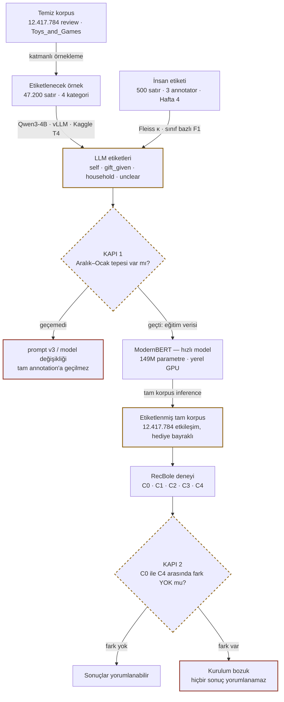

# Hediye Kontaminasyonu — Genel Bakış

> **Buradan başlayın.** Bu dosya projeyi hiç bilmeyen birine baştan anlatır: problem ne,
> ne soruyoruz, ne teslim edeceğiz, neden bu kadar çok adım var, şu an neredeyiz.
> Detay için `PROJECT_SPEC.md`, hafta planı için `ROADMAP.md`, bağlayıcı kurallar için
> `../CLAUDE.md`, karar geçmişi için `DECISIONS.md`.

---

## 1. Problem

Amazon, Netflix, Spotify — hepsinin öneri motoru aynı sessiz varsayımla çalışır:
**satın alma = tercih sinyali.** Buna *implicit feedback* deniyor. Kimse size "bu ürünü
sever misiniz?" diye sormaz; ne aldığınıza bakar ve zevkinizi oradan çıkarır.

Varsayım çoğu zaman işe yarar. Bir yerde tamamen çöker: **hediyeler.**

> Torununa oyuncak tren alan 60 yaşındaki bir kadın, o siparişten sonra aylarca oyuncak
> tren önerisi alır. Ürünü hiç açmamıştır. Zevkini hiç yansıtmaz. Ama sistem için o satın
> alma, kendisi için aldığı her şeyle aynı ağırlıktadır.

Buna **kontaminasyon** diyoruz: kullanıcının tercih profiline, ona ait olmayan bir
sinyalin karışması. Sonuçları üç yerde görünüyor:

- **Kullanıcı için** — öneri listesi alakasız ürünlerle dolar, güven düşer.
- **Pazarlama için** — retargeting bütçesi asla dönüşmeyecek bir ilgiye harcanır.
- **Araştırma için** — akademik değerlendirmelerdeki hata payının bir kısmı model
  zayıflığı değil, *etiket gürültüsü* olabilir.

Literatür bu problemi biliyor ama **ölçmüyor.** "Hediye alımları gürültü yaratır" cümlesi
çok yerde geçiyor; kaç yüzde olduğu, hangi kategoride yoğunlaştığı, temizlendiğinde
önerinin gerçekten düzelip düzelmediği ölçülmemiş. Boşluk burada.

---

## 2. Ne soruyoruz

Dört soru. İlki betimsel, kalanı deneysel.

| Kod | Soru | Neden önemli |
|---|---|---|
| **RQ1** | Hediye alımlarının oranı nedir? Kategoriye ve mevsime göre nasıl değişir? | Problemin büyüklüğü. %0.5 ise kimseyi ilgilendirmez, %11 ise ciddi. |
| **RQ2** | Hediye etkileşimlerini çıkarmak, kullanıcının **kendi** sonraki alımını tahmin etmeyi iyileştirir mi? | Asıl iddia. Kontaminasyon gerçekten zarar veriyor mu, yoksa model zaten baş ediyor mu? |
| **RQ3** | Silmek mi, modele "bu bir hediyeydi" diye söylemek mi daha iyi? | Pratik tavsiye. Silmek veri kaybı; sinyal vermek bilgi kazancı olabilir. |
| **RQ4** | Bir hediye alımından sonra öneri listesi ne kadar süre kirli kalıyor? | Pazarlama karşılığı: "kontaminasyon yarı ömrü". Bütçe kaç hafta boşa gidiyor? |

> **RQ2 bilerek "ne kadar iyileşir" değil "duyarlı mı" diye soruluyor.** İyileşme çıkmazsa
> bu bir başarısızlık değil, bir bulgudur: *modern sequential modeller bu gürültüye
> dayanıklıdır* demek de yayınlanabilir bir sonuçtur. Sonuç beğenilmedi diye parametre
> kurcalamak yasak (`CLAUDE.md` §8.9).

---

## 3. Son çıktı ne olacak

Bu bir **araştırma projesi**, bir ürün değil. Deploy edilmiyor, API'si yok, kullanıcısı yok.
Teslim edilen şey şu dört parça:

| Parça | İçerik |
|---|---|
| **Capstone raporu** | RQ1–RQ4'ün cevapları, yöntem, sınırlamalar. Ana teslim. |
| **Ölçüm sonuçları** | Kategori ve ay bazlı hediye oranları; C0–C4 deneyinin Recall@10 / NDCG@10 tabloları, bootstrap güven aralıklarıyla. |
| **Pazarlama metrikleri** | **M1** retargeting israf oranı · **M2** kontaminasyon yarı ömrü · **M3** segment analizi. Teknik bulguyu bütçe diline çeviren kısım. |
| **Yeniden üretilebilir kod** | Config ile sürülen pipeline, sabitlenmiş seed'ler, testler. Başkası aynı sayıları üretebilmeli. |

---

## 4. Nasıl — ve neden bu kadar adım var

Soru basit görünüyor: "review metnine bak, hediye mi anla." Bunu **12,4 milyon review**
için yapmak gerekiyor ve tek engel burada. Bir dil modelini 12,4 milyon metne koşturmak
elimizdeki donanımla **haftalar** sürer.

Çözüm üç aşamalı: küçük bir örneği **güçlü ama yavaş** bir modele etiketlet, o etiketlerle
**küçük ve hızlı** bir model eğit, hızlı modeli tüm korpusa koştur. Buna *distillation*
(damıtma) deniyor.

Örnek daralıyor, model öğreniyor, etiket tüm korpusa geri yayılıyor. İki kapı,
geçilemezse sonraki aşamanın **başlamadığı** duraklardır.

### Neden dört kategori?

Tek kategoride ölçüm yaparsak "hediye oranı yüksek çıktı" demekten öteye gidemeyiz.
Dört kategori bir **doz–yanıt tasarımı** kuruyor: eğer kontaminasyon gerçekten zarar
veriyorsa, zararın *hediye yoğunluğuyla orantılı* artması gerekir. Grocery kontrol
grubu — orada etki çıkarsa bir yerde hata var demektir.

### Neden insan etiketi şart?

Dil modeli 40.000 review'ı etiketleyecek. Peki doğru etiketlediğini nereden bileceğiz?
Modele soramayız. Tek yol, bir insanın aynı satırları **bağımsız** etiketlemesi ve iki
kümeyi karşılaştırmak. Projedeki tek "gerçek" kaynağı budur — raporlanan her sayı bu 500
satırın üzerine kuruludur. Etiketleme kuralları: [`ETIKETLEME_REHBERI.md`](ETIKETLEME_REHBERI.md).

---

## 5. Nerede duruyoruz

**Hafta 1 ve 2 bitti, planın 6 gün önündeyiz.**

| | |
|---|---|
| Temiz review (4 kategori) | **27,0M** |
| Hediye vekil oranı — Toys_and_Games | **%11,07** |
| Hediye vekil oranı — Grocery (kontrol) | **%1,85** |
| Çekilmiş örnek | **47.200** (180 katman) |
| Geçen test | **127** |

### Hafta 1 — veriyi tanımak

571 milyon review'lık Amazon Reviews 2023 veri setinden dört kategori indirildi,
filtrelendi, kronolojik kullanıcı sekansları kuruldu. Sonra bir **sözcüksel vekil**
yazıldı: `gift`, `bought for my`, `present for` gibi kalıpları arayan basit bir tarayıcı.

> **Bu vekil bir detektör değil — ölçü çubuğu.** Anahtar kelime taraması nihai yöntemimiz
> değil; LLM'in ondan daha iyi olduğunu göstermek için bir taban çizgisi lazım. İki ayrı
> ön geçişte ölçüldü: kesinlik **0,58** ve **0,61**, duyarlılık **0,76**. Yani
> işaretlediği her 10 review'ın yaklaşık 4'ü hediye değil, ve gerçek hediyelerin dörtte
> birini kaçırıyor. LLM'in aşması gereken çıta bu. *Kesin rakam Hafta 4'ün bağımsız insan
> doğrulamasından gelecek — bunlar yazar destekli ön geçiş.*

| Kategori | Rol | Temiz review | Hediye vekil oranı |
|---|---|---:|---:|
| Toys_and_Games | yüksek · **birincil deney** | 12.417.784 | **%11,07** |
| Video_Games | orta | 3.296.440 | %4,40 |
| All_Beauty | pilot · yalnızca pipeline testi | 537.261 | %2,13 |
| Grocery_and_Gourmet_Food | düşük · **kontrol grubu** | 10.774.599 | %1,85 |

Beklenen sıralama çıktı: **Toys > Video Games > Grocery.** Aylık dağılımda da dört
kategoride birden **Aralık–Ocak tepesi** var. Tepe Kasım'da değil çünkü *review tarihi
satın alma tarihinin gerisinde kalıyor* — insanlar hediyeyi Kasım'da alıp Ocak'ta
yorumluyor. Bu bir hata değil, beklenen davranış; başarı kriteri buna göre düzeltildi.

### Hafta 2 — örnekleme ve altyapı

LLM'in etiketleyeceği örnek çekildi. Buradaki tek kritik tasarım kararı **çerçeve
ayrımı**: `main` orantılı katmanlı örnek (yaygınlık oranı **yalnızca** buradan
hesaplanır), `boost` anahtar kelimeyle işaretlenmiş havuzdan ek pozitifler, ve
`boost_received` "hediye aldım" satırlarından ek zor negatifler. Son ikisi eğitim
verisini zenginleştirir, **orana girmez**.

> **Ölçülen bedel.** İki çerçeve karıştırılırsa hediye oranı **%2,13 yerine %15,01**
> görünüyor — yedi kat şişme. Kod hatasız çalışır, sayı makul görünür, tahmin sessizce
> yanlış çıkar. Bu yüzden ayrım bir testle kilitlendi
> (`tests/test_sampling.py::test_pooling_the_frames_inflates_the_rate`).

Ayrıca: etiket şeması (Pydantic + JSON, ikisi arasında parite testi), prompt yükleyici,
ve prompt geliştirme için 200 satırlık zor vaka seti — kasıtlı olarak tuzaklarla
dolduruldu (%50 anahtar kelime işaretli, %26 spekülatif ifade), etiketlendi, ve
sonuçlarından `prompts/gift_detection_v2.md` yazıldı.

---

## 6. Ne kaldı

| Hafta | İş | Durum |
|:---:|---|---|
| 1 | Veri indirme, ön işleme, sözcüksel vekil, derin EDA | ✅ bitti |
| 2 | Katmanlı örnekleme, etiket şeması, prompt v2, 200 deneme etiketi | ✅ bitti |
| 3 | Kaggle'da vLLM kurulumu, 10.000 review'lık pilot annotation, ilk aylık oran eğrisi | ▶ sırada |
| 4 | 500 satır insan etiketleme (3 kişi), Fleiss κ ve sınıf bazlı F1, duyarlılık analizi | ⏳ |
| 5 | Üç kategoride tam annotation, ModernBERT damıtma, tam korpus inference | ⏳ |
| 6 | RecBole atomic file'lar, C0 baseline + C4 plasebo | ⏳ |
| 7 | C1/C2/C3 koşulları, bootstrap güven aralıkları, çoklu seed | ⏳ |
| 8 | M1/M2/M3 pazarlama metrikleri, figürler, final yazım | ⏳ |

### 🚦 Kapı 1 — Hafta 3 sonu · detektör çalışıyor mu?

Aylık hediye oranı **Aralık–Ocak tepesi** gösteriyor mu, ve LLM anahtar kelimenin
kaçırdığı vakaları yakalıyor mu?

Geçemezse prompt v3 yazılır veya model değiştirilir. **Tam annotation'a geçilmez** —
40.000 satırı bozuk bir detektörle etiketlemek hem Kaggle kotasını hem iki haftayı yakar.

### 🚦 Kapı 2 — Hafta 6 sonu · deney geçerli mi?

C0 (baseline) ile C4 (plasebo) arasında anlamlı fark **olmamalı**. C4, hediye sayısı
kadar *rastgele* etkileşim çıkarır — yani "veri silmenin kendisi" ne kadar etki yapıyor
onu ölçer.

Fark çıkarsa kurulum bozuktur (büyük ihtimalle kullanıcı/ürün evreni koşullar arasında
sabitlenmemiştir) ve **hiçbir sonuç yorumlanamaz.**

---

## 7. Bozulmaması gereken kurallar

Bunlar stil tercihi değil. Herhangi biri ihlal edilirse deney geçersizdir ve sonuçlar
yayınlanamaz.

1. **Plasebo koşulu atlanamaz.** C1 kazanıyorsa C4'ten de kazanmak zorunda. Yoksa
   gördüğümüz şey hediye etkisi değil, sadece "veri azaldı" etkisidir.
2. **Kullanıcı ve ürün evreni tüm koşullarda aynı kalır.** 5-core filtreleme bir kez,
   C0 üzerinde uygulanır. Koşul başına yeniden uygulanırsa koşullar kıyaslanamaz.
3. **Test edilen son alım hediye olamaz.** Değerlendirme yalnızca son etkileşimi `self`
   olan kullanıcılarda yapılır — soru "kendi sonraki alımını tahmin edebiliyor muyuz".
4. **Split zaman bazlı olur.** Rastgele bölme geleceği eğitim setine sızdırır ve tüm
   metrikleri şişirir.
5. **İnsan doğrulaması bağımsız olmalı.** Doğrulama etiketleri bir dil modeli yardımıyla
   üretilirse, ölçtüğümüz F1 iki modelin birbirine benzerliğidir — doğruluk değil.
   Projenin tek gerçek referansı budur. (Bkz. `DECISIONS.md`, 2026-08-26.)
6. **Sonuç beğenilmedi diye ayar yapılmaz.** Değişiklik gerekiyorsa `DECISIONS.md`'ye
   tarih ve gerekçeyle yazılır. Null result geçerli bir sonuçtur.

---

## 8. Nereden devam etmeli

| Ne arıyorsanız | Dosya |
|---|---|
| Kurulum ve ilk komutlar | [`../README.md`](../README.md) |
| Bağlayıcı kurallar, etiket şeması, yapılmayacaklar listesi | [`../CLAUDE.md`](../CLAUDE.md) |
| Tam proje dokümanı — gap analizi, iş bölümü, riskler | [`PROJECT_SPEC.md`](PROJECT_SPEC.md) |
| Aşama aşama teknik roadmap | [`ROADMAP.md`](ROADMAP.md) |
| Neden şu yerine bu seçildi (tarihli) | [`DECISIONS.md`](DECISIONS.md) |
| Elle etiketleme yapacaksanız | [`ETIKETLEME_REHBERI.md`](ETIKETLEME_REHBERI.md) |

Buradaki sayılar `reports/results/` altındaki ölçümlerden geliyor ve Hafta 2 sonu
itibarıyla günceldir.
