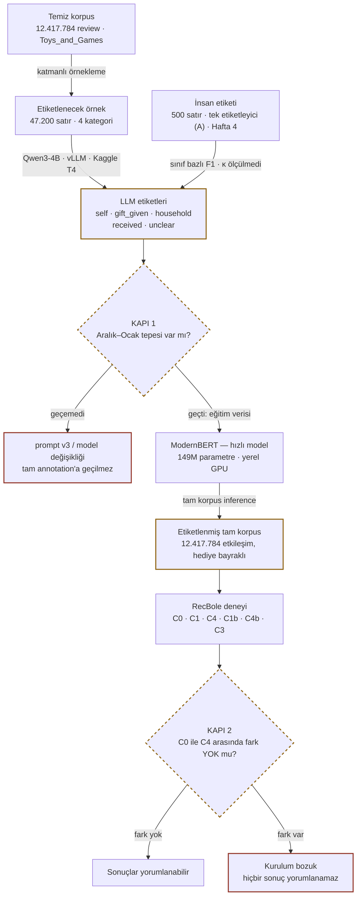

# Hediye Kontaminasyonu — Genel Bakış

> **Buradan başlayın.** Bu dosya projeyi hiç bilmeyen birine baştan anlatır: problem ne,
> ne soruyoruz, ne teslim edeceğiz, neden bu kadar çok adım var, şu an neredeyiz.
> Detay için `PROJECT_SPEC.md`, hafta planı için `ROADMAP.md`, bağlayıcı kurallar için
> `../CLAUDE.md`, karar geçmişi için `DECISIONS.md`.

---

## 1. Problem

Amazon, Netflix, Spotify — hepsinin öneri motoru aynı sessiz varsayımla çalışır:
**satın alma = tercih sinyali.** Buna *implicit feedback* deniyor. Kimse size "bu ürünü
sever misiniz?" diye sormaz; ne aldığınıza bakar ve zevkinizi oradan çıkarır.

Varsayım çoğu zaman işe yarar. Bir yerde tamamen çöker: **hediyeler.**

> Torununa oyuncak tren alan 60 yaşındaki bir kadın, o siparişten sonra aylarca oyuncak
> tren önerisi alır. Ürünü hiç açmamıştır. Zevkini hiç yansıtmaz. Ama sistem için o satın
> alma, kendisi için aldığı her şeyle aynı ağırlıktadır.

Buna **kontaminasyon** diyoruz: kullanıcının tercih profiline, ona ait olmayan bir
sinyalin karışması. Sonuçları üç yerde görünüyor:

- **Kullanıcı için** — öneri listesi alakasız ürünlerle dolar, güven düşer.
- **Pazarlama için** — retargeting bütçesi asla dönüşmeyecek bir ilgiye harcanır.
- **Araştırma için** — akademik değerlendirmelerdeki hata payının bir kısmı model
  zayıflığı değil, *etiket gürültüsü* olabilir.

Literatür bu problemi biliyor ama **ölçmüyor.** "Hediye alımları gürültü yaratır" cümlesi
çok yerde geçiyor; kaç yüzde olduğu, hangi kategoride yoğunlaştığı, temizlendiğinde
önerinin gerçekten düzelip düzelmediği ölçülmemiş. Boşluk burada.

---

## 2. Ne soruyoruz

Dört soru. İlki betimsel, kalanı deneysel.

| Kod | Soru | Neden önemli |
|---|---|---|
| **RQ1** | Hediye alımlarının oranı nedir? Kategoriye ve mevsime göre nasıl değişir? | Problemin büyüklüğü. %0.5 ise kimseyi ilgilendirmez, %11 ise ciddi. |
| **RQ2** | Hediye etkileşimlerini çıkarmak, kullanıcının **kendi** sonraki alımını tahmin etmeyi iyileştirir mi? | Asıl iddia. Kontaminasyon gerçekten zarar veriyor mu, yoksa model zaten baş ediyor mu? |
| **RQ3** | Silmek mi, modele "bu bir hediyeydi" diye söylemek mi daha iyi? | Pratik tavsiye. Silmek veri kaybı; sinyal vermek bilgi kazancı olabilir. |
| **RQ4** | Bir hediye alımından sonra öneri listesi ne kadar süre kirli kalıyor? | Pazarlama karşılığı: "kontaminasyon yarı ömrü". Bütçe kaç hafta boşa gidiyor? |

> **RQ2 bilerek "ne kadar iyileşir" değil "duyarlı mı" diye soruluyor.** İyileşme çıkmazsa
> bu bir başarısızlık değil, bir bulgudur: *modern sequential modeller bu gürültüye
> dayanıklıdır* demek de yayınlanabilir bir sonuçtur. Sonuç beğenilmedi diye parametre
> kurcalamak yasak (`CLAUDE.md` §8.9).

---

## 3. Son çıktı ne olacak

Bu bir **araştırma projesi**, bir ürün değil. Deploy edilmiyor, API'si yok, kullanıcısı yok.
Teslim edilen şey şu dört parça:

| Parça | İçerik |
|---|---|
| **Capstone raporu** | RQ1–RQ4'ün cevapları, yöntem, sınırlamalar. Ana teslim. |
| **Ölçüm sonuçları** | Kategori ve ay bazlı hediye oranları; C0–C4 deneyinin Recall@10 / NDCG@10 tabloları, bootstrap güven aralıklarıyla. |
| **Pazarlama metrikleri** | **M1** retargeting israf oranı · **M2** kontaminasyon yarı ömrü · **M3** segment analizi. Teknik bulguyu bütçe diline çeviren kısım. |
| **Yeniden üretilebilir kod** | Config ile sürülen pipeline, sabitlenmiş seed'ler, testler. Başkası aynı sayıları üretebilmeli. |

---

## 4. Nasıl — ve neden bu kadar adım var

Soru basit görünüyor: "review metnine bak, hediye mi anla." Bunu **12,4 milyon review**
için yapmak gerekiyor ve tek engel burada. Bir dil modelini 12,4 milyon metne koşturmak
elimizdeki donanımla **haftalar** sürer.

Çözüm üç aşamalı: küçük bir örneği **güçlü ama yavaş** bir modele etiketlet, o etiketlerle
**küçük ve hızlı** bir model eğit, hızlı modeli tüm korpusa koştur. Buna *distillation*
(damıtma) deniyor.

Örnek daralıyor, model öğreniyor, etiket tüm korpusa geri yayılıyor. İki kapı,
geçilemezse sonraki aşamanın **başlamadığı** duraklardır.

### Neden dört kategori?

Tek kategoride ölçüm yaparsak "hediye oranı yüksek çıktı" demekten öteye gidemeyiz.
Dört kategori bir **doz–yanıt tasarımı** kuruyor: eğer kontaminasyon gerçekten zarar
veriyorsa, zararın *hediye yoğunluğuyla orantılı* artması gerekir. Grocery kontrol
grubu — orada etki çıkarsa bir yerde hata var demektir.

### Neden insan etiketi şart?

Dil modeli 40.000 review'ı etiketleyecek. Peki doğru etiketlediğini nereden bileceğiz?
Modele soramayız. Tek yol, bir insanın aynı satırları **bağımsız** etiketlemesi ve iki
kümeyi karşılaştırmak. Projedeki tek "gerçek" kaynağı budur — raporlanan her sayı bu 500
satırın üzerine kuruludur. Etiketleme kuralları: [`ETIKETLEME_REHBERI.md`](ETIKETLEME_REHBERI.md).

---

## 5. Nerede duruyoruz

**Hafta 1–4 bitti; Hafta 5'in etiketlemesi de bitti.** Hafta 4 **tek etiketleyiciyle**
kapandı (kapı INCOMPLETE — güvenilirlik ölçülmedi). Sırada damıtma. Ayrıntılı durum ve
sıradaki adımlar için **§8**.

| | |
|---|---|
| Temiz review (4 kategori) | **27,0M** |
| Hediye vekil oranı — Toys_and_Games | **%11,07** |
| Hediye vekil oranı — Grocery (kontrol) | **%1,85** |
| Çekilmiş örnek | **47.200** (180 katman) |
| LLM ile etiketlenmiş | **47.200** (4 × 11.800) |
| Hediye oranı — Toys / Grocery (LLM, ham) | %23,25 / %4,28 |
| **Hediye oranı — Toys / Grocery (insan kalibrasyonlu)** | **%19,0** / **%5,4** |
| LLM–insan uyumu, C1 ekseni (popülasyon) | F1 **0,72** · kesinlik 0,65 |
| Kapı 1 | 4 kategoride **PASS (4/4)** |
| Hafta 4 | **INCOMPLETE** — tek etiketleyici (A), 500 satır |
| Geçen test | **374** |

### Hangi veri, ne kadar

Tek kaynak: **`McAuley-Lab/Amazon-Reviews-2023`** (HuggingFace, açık). Dört kategorinin
review dosyaları **+** ürün metadata'sı indirildi.

| | |
|---|---|
| Ham review JSONL | **15,2 GB** |
| Ham ürün metadata JSONL | **4,35 GB** |
| Ara çıktılar (parquet) | ~8 GB |
| **Dil modeline giden** | **~6 MB** |

Son satır projenin bütün mimarisini açıklıyor: ~28 GB veriden 6 MB'ı LLM'e gidiyor.
27 milyon review'ı dil modeline koşturmak haftalar sürerdi.

**Review alanları** (Amazon 10 veriyor, 7'sini kullanıyoruz): `text`, `title`, `rating`,
`timestamp`, `user_id`, `parent_asin`, `verified_purchase`. `images` hiç okunmuyor;
`asin` taşınıyor ama join'de `parent_asin` kullanılıyor (aynı ürünün renk/beden
varyantlarını birleştiren anahtar o).

**Metadata alanları**: `title` (ürün adı), `main_category`, `store`, `price`,
`average_rating`, `rating_number`, `categories`. Ürün adı prompt'a giriyor — LLM v2'ye
kadar *"she loved it"* cümlesindeki "it"in ne olduğunu bilmiyordu.

### Hafta 1 — veriyi tanımak

571 milyon review'lık Amazon Reviews 2023 veri setinden dört kategori indirildi,
filtrelendi, kronolojik kullanıcı sekansları kuruldu. Sonra bir **sözcüksel vekil**
yazıldı: `gift`, `bought for my`, `present for` gibi kalıpları arayan basit bir tarayıcı.

> **Bu vekil bir detektör değil — ölçü çubuğu.** Anahtar kelime taraması nihai yöntemimiz
> değil; LLM'in ondan daha iyi olduğunu göstermek için bir taban çizgisi lazım. Yazar
> destekli iki ön geçişte kesinlik 0,58 ve 0,61, duyarlılık 0,76 ölçülmüştü.
> **Hafta 4'ün bağımsız ölçümü daha kötü çıktı:** kesinlik **0,41**, duyarlılık **0,51**,
> F1 **0,46** (500 satır, tek etiketleyici). İşaretlediğinin yarısından fazlası hediye
> değil, hediyelerin yarısını kaçırıyor. Aynı satırlarda LLM'in F1'i **0,73**.

| Kategori | Rol | Temiz review | Hediye vekil oranı |
|---|---|---:|---:|
| Toys_and_Games | yüksek · **birincil deney** | 12.417.784 | **%11,07** |
| Video_Games | orta | 3.296.440 | %4,40 |
| All_Beauty | pilot · yalnızca pipeline testi | 537.261 | %2,13 |
| Grocery_and_Gourmet_Food | düşük · **kontrol grubu** | 10.774.599 | %1,85 |

> ⚠️ **Bu oranlar `clean` korpusuna ait. Deney `kcore` üzerinde koşuyor ve orada
> oranlar farklı:** Toys %11,27 · Video Games **%2,68** · Grocery %1,34. 5-core filtresi
> hediye alıcılarını sistematik olarak eliyor (hediye çoğu kez tek seferliktir; tek
> seferlik yorumcular tam da k-core'un sildiği kullanıcılardır). Deney Video Games ve
> Grocery'de **null sonuca doğru yanlı**; Toys'un birincil kategori olmasının gerçek
> gerekçesi de bu. Ayrıntı: `data-research` §4.11 (T8).

Beklenen sıralama çıktı: **Toys > Video Games > Grocery.** Aylık dağılımda da dört
kategoride birden **Aralık–Ocak tepesi** var. Tepe Kasım'da değil çünkü *review tarihi
satın alma tarihinin gerisinde kalıyor* — insanlar hediyeyi Kasım'da alıp Ocak'ta
yorumluyor. Bu bir hata değil, beklenen davranış; başarı kriteri buna göre düzeltildi.

### Hafta 2 — örnekleme ve altyapı

LLM'in etiketleyeceği örnek çekildi. Buradaki tek kritik tasarım kararı **çerçeve
ayrımı**: `main` orantılı katmanlı örnek (yaygınlık oranı **yalnızca** buradan
hesaplanır), `boost` anahtar kelimeyle işaretlenmiş havuzdan ek pozitifler, ve
`boost_received` "hediye aldım" satırlarından ek zor negatifler. Son ikisi eğitim
verisini zenginleştirir, **orana girmez**.

> **Ölçülen bedel.** Üç çerçeve karıştırılırsa hediye oranı **%2,02 yerine %14,42**
> görünüyor — yedi kat şişme. Kod hatasız çalışır, sayı makul görünür, tahmin sessizce
> yanlış çıkar. Bu yüzden ayrım bir testle kilitlendi
> (`tests/test_sampling.py::test_pooling_the_frames_inflates_the_rate`).

Ayrıca: etiket şeması (Pydantic + JSON, ikisi arasında parite testi), prompt yükleyici,
ve prompt geliştirme için 200 satırlık zor vaka seti — kasıtlı olarak tuzaklarla
dolduruldu (%50 anahtar kelime işaretli, %26 spekülatif ifade), etiketlendi, ve
sonuçlarından `prompts/gift_detection_v2.md` yazıldı.

### Hafta 3–5 — dört kategori etiketlendi, RQ1 ölçüldü

Dört kategorinin tamamı Kaggle'da (2× T4) etiketlendi: **47.200 satır**, kategori
başına ~57 dakika. Kapı 1 dördünde de **PASS (4/4)**.

**RQ1'in cevabı** — `main` çerçevesi, kategori başına n = 10.000. Oranlar **clean**
korpusa ait (5-core deney korpusuna değil). "Kalibre" = LLM'in her sınıfının Hafta 4'te
insanın gözünde gerçekte ne olduğuna göre düzeltilmiş oran.

| kategori | rol | C1 · LLM ham | **C1 · insan kalibre** [%95 GA] | C1b · ham | **C1b · kalibre** [%95 GA] |
|---|---|---:|---|---:|---|
| Toys and Games | high | %23,25 | **%19,0** [15,8–22,3] | %44,0 | **%44,2** [40,4–48,4] |
| Video Games | mid | %7,86 | **%7,9** [5,8–10,6] | %15,2 | **%22,7** [17,8–28,1] |
| Grocery and Gourmet Food | low | %4,28 | **%5,4** [3,4–8,3] | %9,6 | **%18,3** [13,4–24,1] |
| All Beauty | pilot | %4,70 | **%5,5** [3,4–8,4] | %8,8 | **%18,0** [12,8–23,5] |

C1 = yalnızca `gift_given` (birincil). C1b = `gift_given` + `household` + `received`
("alıcı ürünü kendisi seçmedi", sağlamlık).

**Kalibrasyon neyi değiştirdi:**
- **Toys'un ham oranı (%23,25) kalibre aralığın dışında.** Deneme koşusundan beri yazılı
  "üst sınır" uyarısı ölçümle doğrulandı: model kendi çocuğuna alınanları hediye sayıyor.
- **Doz–yanıt zayıfladı.** Toys hâlâ açıkça ayrık; ama Video Games artık düşük hediyeli
  gruptan **ayrılamıyor** (ham oranlarda ayrıktı).
- **C1b'nin düşük hediyeli kategorilerdeki kalibre oranlarına temkinli bakın.** Yöntem
  hataları kategoriler arasında havuzluyor ve bu varsayım Toys'ta tutmuyor. Her kategorinin
  kendi hatalarıyla (post-hoc, gürültülü) C1b: All Beauty %6,9 · Grocery %14,0 · Video
  Games %13,0. Gerçek değer muhtemelen iki sayının arasında.

**Doğrulamanın söylediği (Hafta 4, tek etiketleyici A, 500 satır):**

| | model vs A | sözcüksel vekil vs A |
|---|---|---|
| C1 ekseni (hediye mi?) — popülasyon | kesinlik 0,65 · duyarlılık 0,80 · **F1 0,72** | F1 0,46 |
| C1b ekseni — popülasyon | kesinlik 0,84 · duyarlılık 0,74 · **F1 0,79** | — |

> **Model anahtar kelimeden belirgin iyi — ama C1 etiketi gürültülü.** Popülasyonda
> modelin "hediye" dediklerinin yaklaşık üçte biri A'ya göre hediye değil (çoğu kendi
> çocuğuna alınan). Bu, deneyde C1'i plaseboya doğru çeker. Bu yüzden deney koşulmadan
> şu kural yazıldı: **C1 ≈ C4 → "bu etiket hassasiyetiyle saptanamadı", "etki yok" değil;
> C1 > C4 → gerçek etkinin alt sınırı.** Aynı sebeple daha iyi ölçülen C1b ekseni artık
> kesilmiyor.

**Sınırlılık, raporun içinde:** referans **tek kişi**; etiket güvenilirliği ölçülmedi.
`prevalence.json` bunu `human_validation.reliability_measured: false` olarak taşıyor.

---

## 6. Ne kaldı

| Hafta | İş | Durum |
|:---:|---|---|
| 1 | Veri indirme, ön işleme, sözcüksel vekil, derin EDA | ✅ bitti |
| 2 | Katmanlı örnekleme, etiket şeması, prompt v2, 200 deneme etiketi | ✅ bitti |
| 3 | Kaggle'da vLLM kurulumu, Toys'ta 11.800 satırlık pilot annotation, ilk aylık oran eğrisi | ✅ bitti (57 dk, 2× T4) · **Kapı 1 PASS 4/4** |
| 4 | 500 satır insan etiketleme, sınıf bazlı F1, kalibre yaygınlık | ✅ kapandı (2026-09-14) · tek etiketleyici → kapı **INCOMPLETE** (κ ölçülmedi) |
| 5 | Üç kategoride tam annotation, ModernBERT damıtma, tam korpus inference | 🔄 annotation ✅ (4/4, Kapı 1 PASS) · damıtma + çıkarım kodu ✅ (CPU duman testi) · **Kaggle koşusu bekliyor** |
| 6 | RecBole atomic file'lar, C0 baseline + C4 plasebo | 🔄 kod ✅ (gerçek etiket yolu, BPR + SASRec, sentetik duman testi) · **damıtılmış etiket bekliyor** |
| 7 | C1/C1b/C4b/C3 koşulları, bootstrap güven aralıkları, çoklu seed | 🔄 koşul kodu ✅ (C2 kapsam dışı) · eşli bootstrap + Kapı 2 değerlendiricisi ✅ · Kaggle deney betiği ✅ · **koşular bekliyor** |
| 8 | M1/M2/M3 pazarlama metrikleri, figürler, final yazım | ⏳ |

### 🚦 Kapı 1 — Hafta 3 sonu · detektör çalışıyor mu?

Dört ölçüt, dördü de **koşudan önce** sabitlendi (`configs/base.yaml` → `gate1:`,
2026-08-28). Sonucu gördükten sonra eşik gevşetmek yasak — bulguyu geçersiz kılar.

| # | Ölçüt | Eşik | Yakaladığı arıza |
|---|---|---|---|
| 1 | (Ara+Oca) ÷ (Haz–Eyl) hediye oranı, %95 GA 1,0'ı dışlıyor | ≥ 1,25 | **sinyalsizlik** |
| 2 | Vekilin işaretlemediği satırlarda `gift_given` oranı | ≥ %1 | **anahtar kelime taklidi** |
| 3 | parse hatası · `evidence_span` düşürme | < %1 · < %10 | **şema çöküşü** |
| 4 | 200 satırlık deneme setiyle uyum (F1 değil, duman testi) | ≥ %70 | **aşırı tetikleme** |

Ölçüt 1 etiket gerektirmez: hediye vermek gerçek dünyada mevsimseldir ve bedava
sözcüksel vekil bile tepeyi görüyor (1,34–1,90×). LLM'in eğrisi düzse etiketlediği şey
gürültüdür. Ölçüt 2 en pahalı soruyu sorar: LLM bedava bir regex'in işini pahalıya
tekrar ediyorsa bütün damıtma yığını gereksizdir.

Çalıştırma: `python -m gift_contamination.analysis.gate1 --category high`

**Toys_and_Games sonucu (2026-08-28, 11.800 satır, kod `add95f3` · 4. ölçüt
2026-08-29, 200 satır, kod `b9d8664`):**

| # | Ölçüt | Ölçülen | Eşik | |
|---|---|---|---|---|
| 1 | Mevsimsellik oranı | **1,576** · GA [1,434 – 1,730] | ≥ 1,25 | ✅ |
| 2 | Vekil ötesi `gift_given` | **%18,0** | ≥ %1 | ✅ |
| 3 | parse hatası · span düşürme | **%0,03** · **%2,77** | < %1 · < %10 | ✅ |
| 4 | Deneme setiyle uyum | **%83,5** (167/200) | ≥ %70 | ✅ |

Karar **PASS (4/4)**. Tam annotation'a geçilebilir.

4. ölçütün ayrı bir koşu gerektirmesinin sebebi: 200 deneme satırı annotation
örneğinin **içinde değil**. Örnek 2026-08-27'de `boost_received` çerçevesi
eklenince yeniden çekildi ve 200 satırın hiçbiri yeni çekilişte kalmadı (ölçüldü:
50 Toys satırının 0'ı — 16M'lik korpustan 11.800 çekilişte beklenen kesişim 0,04).
Bu satırlar `--trial 200` ile ayrıca etiketlendi.

**4. ölçüt geçti ama sayı bir uyarı taşıyor.** 33 uyuşmazlığın **14'ü** tek bir
yönde: insan `household` demiş, LLM `gift_given`. `household` recall'ı 0,644,
precision'ı 1,000 — LLM bu sınıfı yanlış yere koymuyor, **az** koyuyor ve boşluğu
`gift_given` ile dolduruyor. Sonuç olarak `gift_given` recall 0,975 ama precision
0,796: model hediyeyi **fazla çağırıyor**.

Bu, tam koşudaki **%23,25**'lik hediye oranının muhtemelen bir **üst sınır**
olduğu anlamına gelir. Üstelik bu 200 satır prompt'un yazılırken okunduğu
satırlar (DECISIONS 2026-08-26) — yani sayı iyimser tarafta; görülmemiş veride
fazla çağırma daha kötü olabilir, daha iyi değil. Gerçek ölçüm Hafta 4'ün bağımsız
500 satırı. **Hafta 4 doğruladı (2026-09-14):** insan kalibrasyonlu oran **%19,0**
[15,8–22,3]; ham %23,25 aralığın dışında. Ayrıntı: `reports/results/gate1_Toys_and_Games.json` → `disagreements`,
`per_class`.

Ölçüt bu yüzden **duman testi** diye anılıyor, doğrulama diye değil: prompt'un
gördüğü satırlarda %83,5 uyum, detektörün çalıştığını gösterir — ne kadar iyi
çalıştığını değil.

Geçemezse prompt v4 yazılır veya model değiştirilir (`secondary_model` config'te hazır).
**Tam annotation'a geçilmez** — 47.200 satırı bozuk bir detektörle etiketlemek hem
Kaggle kotasını hem iki haftayı yakar.

### 🚦 Kapı 2 — Hafta 6 sonu · deney geçerli mi?

C0 (baseline) ile C4 (plasebo) arasında anlamlı fark **olmamalı**. C4, hediye sayısı
kadar *rastgele* etkileşim çıkarır — yani "veri silmenin kendisi" ne kadar etki yapıyor
onu ölçer.

Fark çıkarsa kurulum bozuktur (büyük ihtimalle kullanıcı/ürün evreni koşullar arasında
sabitlenmemiştir) ve **hiçbir sonuç yorumlanamaz.**

---

## 7. Bozulmaması gereken kurallar

Bunlar stil tercihi değil. Herhangi biri ihlal edilirse deney geçersizdir ve sonuçlar
yayınlanamaz.

1. **Plasebo koşulu atlanamaz.** C1 kazanıyorsa C4'ten de kazanmak zorunda. Yoksa
   gördüğümüz şey hediye etkisi değil, sadece "veri azaldı" etkisidir.
2. **Kullanıcı ve ürün evreni tüm koşullarda aynı kalır.** 5-core filtreleme bir kez,
   C0 üzerinde uygulanır. Koşul başına yeniden uygulanırsa koşullar kıyaslanamaz.
3. **Test edilen son alım hediye olamaz.** Değerlendirme yalnızca son etkileşimi `self`
   olan kullanıcılarda yapılır — soru "kendi sonraki alımını tahmin edebiliyor muyuz".
4. **Split zaman bazlı olur.** Rastgele bölme geleceği eğitim setine sızdırır ve tüm
   metrikleri şişirir.
5. **İnsan doğrulaması bağımsız olmalı.** Doğrulama etiketleri bir dil modeli yardımıyla
   üretilirse, ölçtüğümüz F1 iki modelin birbirine benzerliğidir — doğruluk değil.
   Projenin tek gerçek referansı budur. (Bkz. `DECISIONS.md`, 2026-08-26.)
6. **Sonuç beğenilmedi diye ayar yapılmaz.** Değişiklik gerekiyorsa `DECISIONS.md`'ye
   tarih ve gerekçeyle yazılır. Null result geçerli bir sonuçtur.

---

## 8. Şu an ne çalışıyor, sırada ne var

> Son güncelleme **2026-09-14** (Hafta 4 kapanışı + Hafta 5 damıtma/çıkarım kodu + Hafta 6 koşul kodu). "Çalışıyor" yazan her satır ya bir
> testle ya da o gün gerçekten koşturulmuş bir komutla kontrol edildi; koşturulamayanlar
> aşağıda ayrıca yazıyor.

### Çalışıyor — doğrulandı

| Aşama | Durum | Nasıl doğrulandı |
|---|---|---|
| İndirme, ön işleme (verified → min_words → dedup → 5-core) | 4 kategori | huni sayaçları `reports/results/preprocess_funnel_*.json` |
| Sözcüksel vekil + EDA (T1–T14, F1–F16) | tamam | `deep_eda` yeniden koşuldu, tablolar **ve** figürler bit düzeyinde aynı çıktı |
| Üç çerçeveli örnekleme (main / boost / boost_received) | tamam | çerçeve ayrımı testle kilitli; havuzlama bedeli ölçüldü (7,1×) |
| LLM annotation (Kaggle, 2× T4, vLLM, prompt v3) | 4 × 11.800 satır | dördü de `backend: vllm`, `is_partial: false`, boş kolon yok |
| **Kapı 1** | 4 kategoride de **PASS (4/4)** | eşikler koşudan önce sabit; `reports/results/gate1_*.json` |
| **Hafta 4 — insan doğrulaması** | **INCOMPLETE** · tek etiketleyici (A), 500 satır | yöntemler `8c697a8`, kod `eed7f35` — ikisi de sonuçtan önce push'landı; `validation_500.json`, F18 |
| **RQ1 yaygınlık** — ham + insan kalibrasyonlu, F19 | tamam | `prevalence.json`; kalibrasyon elle hesaplanmış örnekle test ediliyor |
| Koşullar (C0 · C1 · C4 · C1b · C4b · C3 gölge token; C2 açık hata) + `atomic --labels distilled` | kod tamam, **gerçek etiketle koşmadı** | `test_conditions`, `test_no_leakage`, `test_experiment_labels` |
| Deney koşucusu (BPR + SASRec; gölge ve C0 alınmış ürün maskesi; kullanıcı başı çıktı) | sentetik duman testi geçti | `.venv-recbole`, CPU, 3 epoch, C0/C3/C4b: kullanıcı başı ortalama RecBole toplamına birebir eşit, gölge ürün top-K'da 0 |
| **Damıtma + çıkarım girdileri** (`distill prepare`, `inference prepare`) | yerelde koşuldu | 46.655 eğitim/ayrılmış satır; doğrulama satırlarıyla kesişim **0** (çift ve birebir metin, koddan bağımsız sayıldı); Toys 2.164.018 + Grocery 2.434.594 girdi satırı, kimlikler 5-core'la birebir |
| Damıtma + çıkarım **GPU yolu** (`train`, `run`) | yalnızca CPU duman testi | küçük rastgele ModernBERT ve DeBERTa, transformers 5.17: eğitim → kapı → rapor → parça parça çıkarım uçtan uca; **T4 üzerinde henüz koşmadı** |
| **Kapı 2 + eşli bootstrap** (`experiment_stats`) | kod tamam, **gerçek koşu yok** | `test_experiment_stats`; 24 sentetik koşunun çıktısından `gate2.json` üretildi |
| Kaggle deney betiği (`scripts/kaggle_experiment.py`) | yerelde CPU simülasyonu | kurulum tarifi torch 2.14 + numpy 2.5 ortamında `.venv-recbole` ile birebir aynı sayıları verdi; **Kaggle'da henüz koşmadı** |
| Test paketi | **374 test geçiyor** | `pytest tests -q` |

### Kısmi

- **Öneri deneyi gerçek etiketi bekliyor.** `atomic --labels distilled` yazıldı ama
  girdisi (`*_inferred.parquet`) Kaggle koşusundan gelecek. O zamana kadar üretilen her
  deney çıktısı `label_source: proxy` ve `reportable: false` damgalı — bilinçli bir kilit.
- **Deney gerçek boyutta hiç koşmadı.** Süre ve bellek zaman sondasında (Kaggle,
  `PLAN = "probe"`) ölçülecek; matris ondan sonra bütçelenir.

### Yazılmadı

`recsys/marketing_metrics.py` (M1/M2/M3) · sonuç figürleri F20–F23 · `docs/SONUCLAR.md`. Config'te bu aşamalara ait anahtarlar **"⚠️ HENÜZ OKUNMUYOR"** diye
işaretli; `tests/test_config_keys.py` işaretsiz ölü anahtar kalmasını engelliyor.

### Bilinen sınırlar

- **İnsan referansı tek kişi; etiket güvenilirliği ölçülmedi.** Hafta 4 kapısı bu yüzden
  INCOMPLETE. Kullanıcı kararı, 2026-09-14.
- **C1 etiketi gürültülü:** popülasyonda kesinlik 0,65, duyarlılık 0,80. C1b daha iyi
  (0,84 / 0,74). Deney sonuçları buna göre okunacak (yorum kuralı DECISIONS'ta, deneyden önce).
- **Kalibrasyonun varsayımı Toys'ta tutmuyor** — PPV kategoriden bağımsız değil. Düşük
  hediyeli kategorilerde C1b'nin kalibre oranı muhtemelen yukarı yanlı.
- `received` sınıfı pratikte güvenilmez: A yalnızca 11 kez kullandı, modelin bu sınıftaki
  kesinliği popülasyonda 0,09.
- Oranlar **clean** korpusa ait; 5-core deney korpusunda farklılar (T8).
- `data/raw` **boş** (~16 GB temizlendi). `download` ve `preprocess` yerelde yeniden
  koşulamaz; sonraki aşamalar `data/interim/` üzerinden çalışıyor.
- `confidence` alanı analizden düşürüldü (`low` ≡ `unclear`, %100 örtüşme).
- Deneme setiyle uyum **F1 olarak raporlanamaz**: prompt tam o satırlar okunarak yazıldı.

---

### Sıradaki adımlar — öncelik sırasıyla

Tam plan ve takvim (28 Ekim varsayımıyla): `DECISIONS.md` 2026-09-14 kayıtları.

**1 · DAMITMA ve TAM KORPUS ÇIKARIMI** (Hafta 5) — **kod hazır, Kaggle koşusu
bekliyor.** 47.200 LLM etiketinden 500 doğrulama satırı ve 45 ayrıştırma hatası
dışlandı → 46.655 satır (eğitim 41.988 · ayrılmış 4.667). Sadakat kapısı eğitimden
önce yazıldı: C1 ve C1b eksenlerinde öğrenci–öğretmen F1 ≥ 0,85, öğrencinin insana
karşı C1 F1'i öğretmeninkinden (0,731) en fazla 0,05 düşük. Kapı PASS ise Toys +
Grocery 5-core'unun her satırı (4,6 milyon) etiketlenir. Adımlar:
1. Yerelde üretilmiş dört dosyayı (`data/processed/distill/` altında: `bundle`, `human`,
   `infer_Toys_and_Games`, `infer_Grocery_and_Gourmet_Food`) **özel** bir Kaggle
   dataset'ine yükleyin — review metni taşıyorlar.
2. `scripts/kaggle_distill.py`'yi bir notebook hücresine yapıştırıp GPU T4 ×2 ve
   Internet açıkken çalıştırın.
3. `out/` klasörünü indirin: `*.json` → `reports/results/`, `*_inferred.parquet` →
   `data/annotations/`.

**2 · KOŞUL KODU** — ✅ **yazıldı (2026-09-14)**: C1b + **C4b** plasebosu · **C3 gölge
token** (RQ3) · C2 açık hatayla kilitli · `atomic --labels distilled` · kullanıcı başı
metrikler · SASRec yolu · alınmış ürün maskesi bütün koşullarda C0'ın. Gerekçe:
DECISIONS 2026-09-14 "Hafta 6 kodu".

**3 · DENEY — Kapı 2** (Hafta 6–7) — {Toys, Grocery} × {SASRec, BPR} × 3 seed;
C0 / C1 / C4 / **C1b / C4b** (kesilmez) / C3. Kapı 2'nin ölçütleri koşulardan önce yazıldı.
**Kod hazır; damıtılmış etiketi bekliyor.** Adımlar (1. adımın çıktısı geldikten sonra):
1. Yerelde: `recsys.atomic --category high --labels distilled --force` (ve `low`).
2. `data/processed/recbole/<kategori>/` altındaki `<kategori>.inter` + `split.json`
   dosyalarını (iki kategori, dört dosya) **özel** bir Kaggle dataset'ine yükleyin.
3. `scripts/kaggle_experiment.py`'yi `PLAN = "probe"` ile çalıştırın (zaman sondası),
   süreye göre `PLAN = "matrix"`. Oturum kesilirse önceki `out/`'u ikinci dataset olarak
   ekleyip `PREVIOUS_OUT_PATH`'i doldurun — biten koşular atlanır.
4. `out/`'u indirin: `*.json` → `reports/results/`, `peruser/<kategori>/` →
   `data/processed/recbole/<kategori>/peruser/`.

**4 · İSTATİSTİK** — ✅ kod hazır: `analysis.experiment_stats` → `gate2.json` +
`experiment_stats.json` (C1−C4, C1−C0, C3−C1, C3−C0, C1b−C4b, doz–yanıt; eşli bootstrap).

**5 · PAZARLAMA METRİKLERİ** (Hafta 8) — M1 israf oranı · M2 yarı ömür · M3 segment.

**6 · SONUÇ RAPORU** — RQ1–RQ4, her biri güven aralığıyla ve sınırlılıklarıyla birlikte.

**Kesme sırası** (teslim erken çıkarsa): M3 → BPR'nin ek seed'leri → Grocery'de C3.
**Kesilmez:** C0/C1/C4, C1b/C4b, Toys × SASRec × C3.

---

## 9. Nereden devam etmeli

| Ne arıyorsanız | Dosya |
|---|---|
| Kurulum ve ilk komutlar | [`../README.md`](../README.md) |
| Bağlayıcı kurallar, etiket şeması, yapılmayacaklar listesi | [`../CLAUDE.md`](../CLAUDE.md) |
| Tam proje dokümanı — gap analizi, iş bölümü, riskler | [`PROJECT_SPEC.md`](PROJECT_SPEC.md) |
| Aşama aşama teknik roadmap | [`ROADMAP.md`](ROADMAP.md) |
| Neden şu yerine bu seçildi (tarihli) | [`DECISIONS.md`](DECISIONS.md) |
| Elle etiketleme yapacaksanız | [`ETIKETLEME_REHBERI.md`](ETIKETLEME_REHBERI.md) |

Buradaki sayılar `reports/results/` altındaki ölçümlerden geliyor. En son
2026-08-29 denetiminde doğrulandılar; güncel durum için §8'e bakın.
